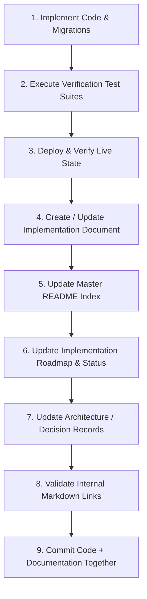

# SNS Projects Documentation Standard & Governance

## 1. Purpose & Core Principles

This document defines the authoritative standard for all documentation within the StacknStock Projects (SNS Projects) engineering organization. Documentation is an integral, mandatory component of the software development lifecycle. An implementation is **NOT DONE** until its corresponding documentation is written, verified, and cross-linked.

### Fundamental Rules
1. **Never Commit Secrets**: Documentation must **NEVER** contain real credentials, database passwords, temporary/permanent employee passwords, `service_role` keys, JWT/access tokens, refresh tokens, or private environment configurations. Always use redacted placeholders or environment variable references.
2. **Accurate & Authoritative**: Document facts as implemented and verified in the codebase, never speculative or unapproved designs.
3. **Traceability**: Every technical specification, decision record, and implementation report must cite relevant commit hashes, migration versions, and verification test scripts.
4. **Mandatory Completion Gate**: No engineering task or package may be closed without updating the documentation suite.

---

## 2. Directory Taxonomy & Folder Ownership

The `Documentation/` directory is organized into domain-specific, numbered categories:

```
Documentation/
│
├── README.md                                # Master Documentation Index
│
├── 00_Governance/                           # Standards, roadmaps, policies
│   ├── DOCUMENTATION_STANDARD.md
│   └── IMPLEMENTATION_ROADMAP.md
│
├── 01_Product_Architecture/                 # System blueprints, user journeys, high-level design
├── 02_Database_and_Data_Architecture/       # Schema definitions, ERDs, migration standards
├── 03_Security_and_Authentication/          # RLS models, Auth workflows, audit logs, CVE reports
├── 04_Defined_Processes/                    # Defined Process Engine, DAGs, RACI specifications
├── 05_Finance/                              # Financial hierarchy, cost tracking, budgets
│
├── 06_Implementation_Packages/              # Discrete execution packages
│   ├── Package_01_Core_Foundation/
│   ├── Package_02_Process_Runtime/
│   ├── Package_03_Hierarchy_UI/
│   ├── Package_04_Finance_Foundation/
│   ├── Package_05_Expense_Execution/
│   ├── Package_06_Finance_UI/
│   ├── Package_07_Financial_Hierarchy/
│   └── Package_08_Regression_and_Import/
│
├── 07_Testing_and_QA/                       # Test strategies, contract suites, E2E policies
├── 08_Deployment_and_Operations/            # CI/CD, seed datasets, disaster recovery
├── 09_Decision_Records/                     # Architecture Decision Records (ADRs)
├── 10_Release_Notes/                        # Production changelogs and hotfix summaries
└── 99_Archive/                              # Historical or superseded reference materials
```

---

## 3. Document Lifecycle Statuses

Every technical and implementation document must declare an authoritative status in its header metadata:

| Status | Definition |
| :--- | :--- |
| **`PLANNED`** | Architecture designed, approved for implementation, not yet coded. |
| **`IN_PROGRESS`** | Actively being implemented or tested. |
| **`IMPLEMENTED`** | Code written and applied locally, pending production verification. |
| **`VERIFIED`** | Deployed to production, regression tested, and fully verified. |
| **`SUPERSEDED`** | Replaced by a newer architectural standard or package. |
| **`ARCHIVED`** | Retained for historical context only; no longer active. |

---

## 4. File Naming Conventions

All Markdown files must follow predictable, descriptive naming patterns:
- **Implementation Packages**: `<PackageID>_<Descriptive_Title>.md` (e.g. `P1-01_Core_Hierarchy_Process_Instance_Foundation.md`, `P1-01A_Process_Instance_Access_Hardening.md`)
- **Architecture Blueprints**: `SNS_Projects_<Topic>_Blueprint.md`
- **Decision Records**: `<DOMAIN>_ARCHITECTURE_DECISIONS.md` (e.g. `ARCHITECTURE_AND_PROCESS_DECISIONS.md`)
- **Release Notes / Hotfixes**: `<Type>_<Feature_or_Issue>.md` (e.g. `Hotfix_Workspace_Members_Rendering.md`)

*Forbidden Names*: `notes.md`, `temp.md`, `doc.md`, `new.md`, `final.md`, `report2.md`.

---

## 5. Standard Implementation Document Template

Every package implementation document in `06_Implementation_Packages/` must follow this structure:

```markdown
# [Package ID] — [Title]

## Document Control
- **Status**: VERIFIED / IMPLEMENTED / PLANNED
- **Package**: [e.g. Package 1: Core Foundation]
- **Implementation Commit**: [Git commit hash]
- **Canonical Migration**: [Migration timestamp filename or N/A]
- **Target Project**: [Supabase Project Reference]
- **Date**: [YYYY-MM-DD]
- **Last Verified**: [YYYY-MM-DD]

## 1. Objective & Business Context
[Why was this change made? What problem does it solve?]

## 2. Architectural Changes
[Previous vs Target state, structural hierarchy changes]

## 3. Implementation Details
[Schema changes, RPC contracts, frontend modifications, triggers]

## 4. Security & Access Control
[RLS policies, role grants, invoker security, fail-closed assertions]

## 5. Verification & Testing
[Test scripts executed, assertion results, regression suites]

## 6. Known Limitations & Future Dependencies
[What remains open? What does the next package depend on?]

## 7. Change History
[Changelog of revisions to this document]
```

---

## 6. Implementation & Documentation Workflow (Mandatory Gate)

For every future engineering task, feature, or hotfix, developers must follow this strict 9-step sequence:



1. **Implement**: Code changes and forward migrations.
2. **Test**: Run automated test suites and verify contracts.
3. **Deploy & Verify**: Apply migrations and confirm production behavior.
4. **Update Implementation Doc**: Write comprehensive technical spec in `06_Implementation_Packages/`.
5. **Update Master Index**: Register the new document in `Documentation/README.md`.
6. **Update Roadmap**: Advance status in `00_Governance/IMPLEMENTATION_ROADMAP.md`.
7. **Update Decision Records**: Record any architectural decisions made.
8. **Verify Links**: Ensure all relative Markdown links resolve correctly.
9. **Commit Together**: Commit source code, tests, and documentation in a single unified atomic commit.
