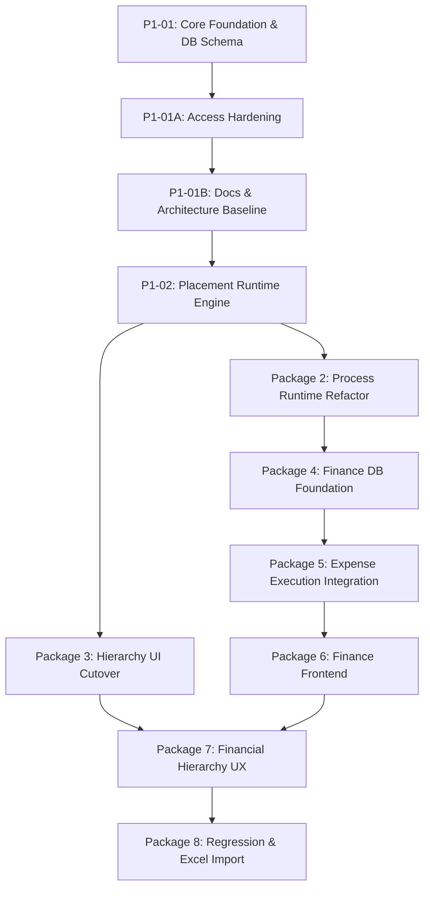

# SNS Projects — Technical Implementation Roadmap

## Overview

This roadmap defines the canonical execution sequence for SNS Projects V2 platform evolution. Each package builds upon the foundational database schemas, security guarantees, and runtime abstractions of prior packages.

---

## Approved Package Sequence & Status

| Package | Code | Scope | Status | Canonical Reference |
| :--- | :--- | :--- | :--- | :--- |
| **Package 1** | `P1-01` | Core Hierarchy + Process Instance Database Foundation | **`VERIFIED`** | `20260817063502_core_hierarchy_process_instance_foundation.sql` |
| **Package 1** | `P1-01A` | Process Instance Access Hardening & Documentation Baseline | **`VERIFIED`** | `20260817064609_p1_01_process_instance_access_hardening.sql` |
| **Package 1** | `P1-01B` | Documentation Accuracy & Authoritative Architecture Baseline | **`VERIFIED`** | Commit `64fd803` + Current Baseline |
| **Package 1** | `P1-02` | Placement-Aware Process Runtime + Standalone Execution | **`NEXT`** | Planned Runtime RPCs & Placement Handlers |
| **Package 2** | `P2-01..` | Process Runtime Refactor & Multi-Instance Engine | **`PLANNED`** | Dynamic DAG instantiation, Step execution |
| **Package 3** | `P3-01..` | Hierarchy UI / UX Alignment (Phase, Task List, Child Tasks) | **`PLANNED`** | Full UI cutover to Phase terminology |
| **Package 4** | `P4-01..` | Finance Database Foundation (Budgets, Buffers, Expense Ledger) | **`PLANNED`** | Financial schemas, RLS, audit logs |
| **Package 5** | `P5-01..` | Expense Execution Integration (Atomic Intercept, Reallocations) | **`PLANNED`** | Task/Process Expense attachments & audit |
| **Package 6** | `P6-01..` | Finance Frontend (Overview, Financial Explorer, Alert Center) | **`PLANNED`** | Financial management UI, Reports, Analytics |
| **Package 7** | `P7-01..` | Financial Hierarchy UX (Compact Bars, Hover Cards, Rollups) | **`PLANNED`** | Hierarchical financial visualization |
| **Package 8** | `P8-01..` | System Regression + Defined Process Excel Import | **`PLANNED`** | Bulk template ingestion & E2E certification |

---

## Package Dependency Architecture

---

## Detailed Package Scopes

### Package 1: Core Foundation & Placement Architecture
- **P1-01 (`VERIFIED`)**: Established `phase_id` compatibility on `tasks` and `task_lists` with dual-sync triggers, added `parent_task_id`, made `tasks.project_id` nullable, created `public.phases` view, and created `public.process_instances` entity with placement integrity constraints.
- **P1-01A (`VERIFIED`)**: Hardened `public.process_instances` permissions to strict fail-closed state (zero direct client table privileges, dropped broad workspace SELECT policy).
- **P1-01B (`VERIFIED`)**: Repaired technical baseline facts, established authoritative Decision Registers (Preserving Decision 32 = PARKED), created Finance Architecture Specification, and eliminated non-portable link patterns.
- **P1-02 (`VERIFIED`)**: Implementation of placement-aware Defined Process execution RPC (`public.start_process_instance` supporting standalone, project, phase, task_list, and task placements), equal-weight progress calculation (`public.get_process_instance_progress`), and granular participant/RACI authorization rules (`private.can_read_process_instance`, `private.can_start_process_version`). [P1-02 Spec](../06_Implementation_Packages/Package_01_Core_Foundation/P1-02_Placement_Aware_Process_Runtime_Engine.md).
- **P1-02A (`VERIFIED`)**: Process Runtime Execution, Security & Idempotency Closure. Resolved execution engine branching on `process_instance_id`, multi-instance isolation in shared task lists, host task list immutability, server-enforced start idempotency via `start_request_id`, elimination of Security Advisor warnings via `SECURITY INVOKER` wrappers, caller authorization checks on progress calculation, and owner security locking. [P1-02A Spec](../06_Implementation_Packages/Package_01_Core_Foundation/P1-02A_Process_Runtime_Execution_and_Security_Closure.md).
- **P1-02B (`VERIFIED`)**: Production Deployment & Real Database E2E Verification Closure. Audited migration safety, verified non-simulated real PostgreSQL lifecycle tests, deployed forward migration `20260817072340` via Supabase CLI, verified remote tip and zero-WARN Security Advisor posture. [P1-02B Spec](../06_Implementation_Packages/Package_01_Core_Foundation/P1-02B_Production_Deployment_and_E2E_Verification.md).

> [!NOTE]
> **Package 1 Foundation Closure**: `P1-01` + `P1-01A` + `P1-01B` + `P1-02` + `P1-02A` + `P1-02B` are **`VERIFIED`**. Package 1 Core Foundation is 100% complete. Package 2 is **`NEXT`**.

### Package 2: Process Runtime Refactor
- Multi-instance process execution per Task and Task List.
- Step-level task execution with independent RACI, approval cycles, and evidence submission.
- Complete lifecycle management (`running` $\to$ `completed` / `cancelled`).

### Package 3: Hierarchy UI / UX Alignment
- Frontend transition from Milestone $\to$ Phase terminology across all components.
- Chevron-based hierarchical expansion for Parent Tasks and Child Step Tasks.
- Multi-process visualization under parent tasks.

### Package 4: Finance Database Foundation
- Schemas for Base Budgets, fixed Safety Buffers, and hierarchical allocation tracking on Projects, Phases, and Task Lists.
- Core Expense Ledger table, financial audit schemas, and deterministic risk band calculations (`GREEN`, `YELLOW`, `ORANGE`, `RED`).
- RLS policies protecting financial data (Finance Operator vs Admin / Executive roles).

### Package 5: Expense Execution Integration
- Atomic task completion expense intercept dialog (*Complete without Expense* vs *Add Expense & Complete*).
- Support for single totals and split amounts.
- Cumulative rework expense tracking.
- Expense correction, void, and admin hard-delete with immutable audit tombstones.

### Package 6: Finance Frontend
- **Overview Dashboard**: High-level financial summary, burn rates, and project budgets.
- **Financial Explorer**: Multi-dimensional search, custom grouping, and export filters.
- **Alert Center**: Persistent risk notifications and resolution workflows ($\text{Open} \to \text{Acknowledged} \to \text{Resolved}$).

### Package 7: Financial Hierarchy UX
- Compact financial utilization bars and risk indicators in project hierarchy views.
- Financial hover summary popovers (Base, Buffer, Actual, Remaining, Overruns).
- Dynamic rollups from leaf work through Tasks, Task Lists, Phases, and Projects.

### Package 8: Regression & Defined Process Excel Import
- Bulk spreadsheet parser for Defined Process templates (DAG steps, RACI matrices, durations, evidence requirements).
- Full platform regression validation and Day-N operational certification.
