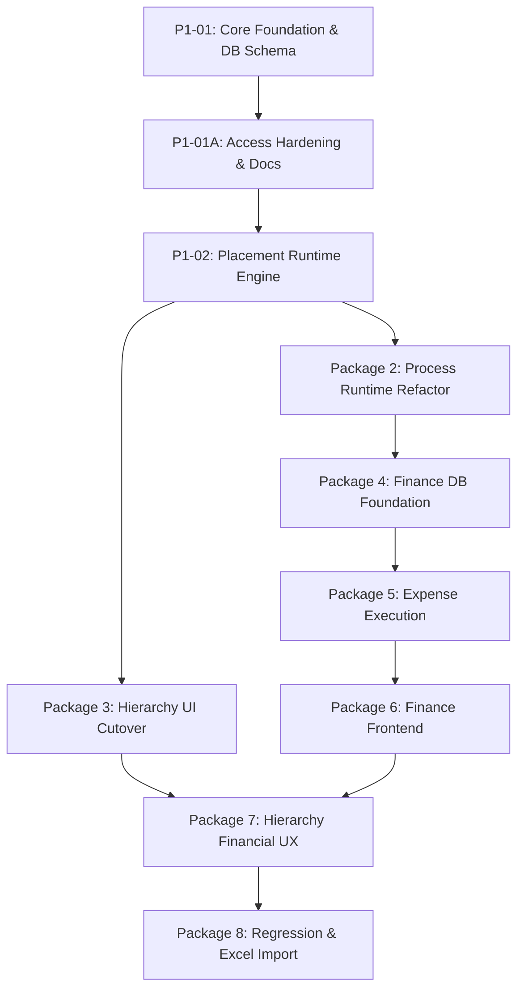

# SNS Projects — Technical Implementation Roadmap

## Overview

This roadmap defines the canonical execution sequence for SNS Projects V2 platform evolution. Each package builds upon the foundational database schemas, security guarantees, and runtime abstractions of prior packages.

---

## Approved Package Sequence & Status

| Package | Code | Scope | Status | Target / Migration |
| :--- | :--- | :--- | :--- | :--- |
| **Package 1** | `P1-01` | Core Hierarchy + Process Instance Database Foundation | **VERIFIED** | `20260817063502_core_hierarchy_process_instance_foundation.sql` |
| **Package 1** | `P1-01A` | Process Instance Access Hardening & Documentation Baseline | **VERIFIED** | `20260817064609_p1_01_process_instance_access_hardening.sql` |
| **Package 1** | `P1-02` | Placement-Aware Process Runtime + Standalone Execution | **NEXT** | Planned RPC & Runtime Hardening |
| **Package 2** | `P2-01..` | Process Runtime Refactor & Multi-Instance Engine | **PLANNED** | Dynamic DAG instantiation, Step execution |
| **Package 3** | `P3-01..` | Hierarchy UI / UX Alignment (Phase, Task List, Child Tasks) | **PLANNED** | Full UI cutover to Phase terminology |
| **Package 4** | `P4-01..` | Finance Database Foundation (Budgets, Cost Centers, POs) | **PLANNED** | Financial schemas, RLS, audit logs |
| **Package 5** | `P5-01..` | Expense Execution Integration | **PLANNED** | Task/Process Expense attachments & approvals |
| **Package 6** | `P6-01..` | Finance Frontend & Dashboards | **PLANNED** | Financial management UI, Reports, Analytics |
| **Package 7** | `P7-01..` | Hierarchy Financial UX (Rollup costs from Task to Project) | **PLANNED** | Recursive financial rollups across hierarchy |
| **Package 8** | `P8-01..` | System Regression + Defined Process Excel Import/Export | **PLANNED** | End-to-end regression validation, bulk tooling |

---

## Package Details & Dependency Graph

### Package 1: Core Foundation & Placement Architecture
- **P1-01 (`VERIFIED`)**: Established `phase_id` compatibility on `tasks` and `task_lists` with dual-sync triggers, added `parent_task_id`, made `tasks.project_id` nullable, created `public.phases` view, and created `public.process_instances` entity with placement integrity constraints.
- **P1-01A (`VERIFIED`)**: Hardened `public.process_instances` permissions to strict fail-closed state (zero direct client table privileges, dropped broad workspace SELECT policy) and established the enterprise documentation framework.
- **P1-02 (`NEXT`)**: Implementation of placement-aware Defined Process execution RPCs (`start_defined_process` supporting standalone, project, phase, task_list, and task placements) and granular participant/RACI authorization.

### Package 2: Process Runtime Refactor
- Refactoring runtime execution to instantiate steps as full tasks (`process_instance_id` + `parent_task_id`).
- Lifecycle management (running $\to$ completed / cancelled).
- Elimination of single-process-per-task-list restriction.

### Package 3: Hierarchy UI / UX Alignment
- Transition frontend UI terminology and components from Milestone $\to$ Phase.
- Support for rendering Child Tasks (Process Steps) nested beneath Parent Tasks.
- Multi-level task hierarchy display in Kanban and List views.

### Package 4: Finance Database Foundation
- Schemas for Cost Centers, GL Accounts, Budgets, and Purchase Orders.
- Row-level security for financial controllers, auditors, and executive roles.

### Package 5: Expense Execution Integration
- Direct linking of expenses, invoices, and payment milestones to Tasks, Child Tasks, and Process Instances.
- Multi-level approval workflows for budget overages.

### Package 6: Finance Frontend
- Organization-wide and project-level financial dashboards.
- Expense entry modals, budget allocation controls, and audit trails.

### Package 7: Hierarchy Financial UX
- Automated rollup calculations (Task $\to$ Task List $\to$ Phase $\to$ Project $\to$ Workspace).
- Real-time variance tracking against allocated baseline budgets.

### Package 8: Regression & Defined Process Excel Import
- Bulk spreadsheet parser for Defined Process templates (DAG steps, RACI matrices, durations, evidence requirements).
- Full platform regression validation and Day-N operational certification.
