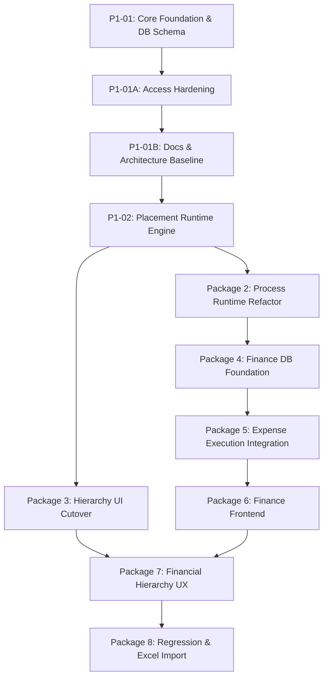

# SNS Projects — Technical Implementation Roadmap

## Overview

This roadmap defines the canonical execution sequence for SNS Projects V2 platform evolution. Each package builds upon the foundational database schemas, security guarantees, and runtime abstractions of prior packages.

---

## Approved Package Sequence & Status

| Package | Code | Scope | Status | Canonical Reference |
| :--- | :--- | :--- | :--- | :--- |
| **Package 1** | `P1-01` | Core Hierarchy + Process Instance Database Foundation | **`VERIFIED`** | `20260817063502_core_hierarchy_process_instance_foundation.sql` |
| **Package 1** | `P1-01A` | Process Instance Access Hardening & Documentation Baseline | **`VERIFIED`** | `20260817064609_p1_01_process_instance_access_hardening.sql` |
| **Package 1** | `P1-01B` | Documentation Accuracy & Authoritative Architecture Baseline | **`VERIFIED`** | Commit `64fd803` + Current Baseline |
| **Package 1** | `P1-02` | Placement-Aware Process Runtime + Standalone Execution | **`NEXT`** | Planned Runtime RPCs & Placement Handlers |
| **Package 2** | `P2-01` | Controlled Milestone → Phase Rename | **`VERIFIED`** | `20260817115837_p2_01_controlled_milestone_phase_rename.sql` |
| **Package 2** | `P2-01A` | Phase Grant Hardening & Browser Acceptance | **`VERIFIED`** | `20260817122020_p2_01a_phase_grant_hardening.sql` |
| **Package 2** | `P2-02` | Process Instance Movement, Cancellation, Authorization & Audit | **`VERIFIED`** | `20260817123556_p2_02_process_instance_movement_cancellation.sql` |
| **Package 2** | `P2-02A` | Post-Cancellation Immutability Final Closure | **`VERIFIED`** | `20260817132234_p2_02a_post_cancellation_immutability.sql` |
| **Package 2** | `P2-03` | Parent Task Completion + Runtime Closure | **`VERIFIED`** | `20260817142153_p2_03_parent_completion_runtime.sql` |
| **Package 3** | `P3-01` | Operational Hierarchy UI Cutover | **`VERIFIED`** | [P3-01 Spec](../06_Implementation_Packages/Package_03_Hierarchy_UI/P3-01_Operational_Hierarchy_UI_Cutover.md) — manual signed-in production acceptance passed |
| **Package 3** | `P3-02` | Subtask Hierarchy and Operational Closure | **`VERIFIED`** | [P3-02 Spec](../06_Implementation_Packages/Package_03_Hierarchy_UI/P3-02_Subtask_Hierarchy_and_Operational_Closure.md) — Package 3 complete and verified |
| **Operational V1** | `OV1-A` | Server-Enforced Operational Visibility Access Closure | **`VERIFIED`** | [OV1-A Security Closure](../03_Security_and_Authentication/OV1-A_Operational_Visibility_Access_Closure.md) · Hotfix tip `20260818120101` |
| **Operational V1** | `OV1-B` | Frontend Visibility Alignment | **`VERIFIED`** | [Operational V1 Certification](../07_Testing_and_QA/SNS_Projects_Operational_V1_Stability_Certification.md) · Frontend commit `c176835` |
| **Operational V1** | `OV1-C` | Role-Aware Dashboard Engine | **`VERIFIED`** | [Operational V1 Certification](../07_Testing_and_QA/SNS_Projects_Operational_V1_Stability_Certification.md) · Frontend tip `e518350` |
| **Package 5** | `P5-01..C` | Expense Execution Runtime & Audit APIs | **`VERIFIED`** | [P5-01 Spec](../06_Implementation_Packages/Package_05_Expense_Execution/P5-01_Expense_Execution_Runtime.md) · Migration tip `20260819190058` |
| **Package 5** | `P5-02..C` | Expense Execution Frontend & Action Modals | **`VERIFIED`** | [P5-02 Spec](../06_Implementation_Packages/Package_05_Expense_Execution/P5-02_Expense_Execution_Frontend.md) · Migration tip `20260819214046` (P5-02A) · Manual acceptance PASSED |
| **Package 5** | `P5-03` | Subtask Completion, Expense Capture & Parent Closure Convergence | **`VERIFIED`** | [P5-03 Spec](../06_Implementation_Packages/Package_05_Expense_Execution/P5-03_Subtask_Completion_Expense_Parent_Closure.md) · Migration tip `20260820082034` (P5-03B ACL hotfix) · Frontend `47d17ce` (P5-03C live state sync) · All 37 test assertions passed · Manual production acceptance PASSED |
| **Package 6** | `P6-01..04C1` | Finance Frontend (Overview, Budgets, Expenses, Explorer & Saved Views) | **`VERIFIED / FROZEN`** | [P6-01 Spec](../06_Implementation_Packages/Package_06_Finance_Frontend/P6-01_Finance_Overview_Dashboard.md) · [P6-02 Spec](../06_Implementation_Packages/Package_06_Finance_Frontend/P6-02_Budget_Configuration_UI.md) · [P6-03 Spec](../06_Implementation_Packages/Package_06_Finance_Frontend/P6-03_Expense_Ledger_and_Administration.md) · [P6-04 Spec](../06_Implementation_Packages/Package_06_Finance_Frontend/P6-04_Financial_Explorer_Core.md) · [P6-04C Spec](../06_Implementation_Packages/Package_06_Finance_Frontend/P6-04C_Persistent_Financial_Explorer_Saved_Views.md) · All test suites passed · Manual acceptance PASSED |
| **Package 6** | `P6-05 / P6-05R1` | Finance Alert Runtime & Persistent Alert Backend | **`VERIFIED / FROZEN`** | [P6-05 Spec](../06_Implementation_Packages/Package_06_Finance_Frontend/P6-05_Finance_Alert_Runtime.md) · Migrations `20260822144843` & `20260822152000` · Persistent incident ledger (`public.finance_alerts`), private risk state, private notification events tracking, automated CEO/CTO high-risk notifications, deferred triggers, private function execution closure · All 40 assertions passed |
| **Package 6** | `P6-05A` | Frontend Alert Center & Operational Workflows | **`VERIFIED / FROZEN`** | [P6-05A Spec](../06_Implementation_Packages/Package_06_Finance_Frontend/P6-05A_Finance_Alert_Center_Frontend.md) · All 58 test assertions passed · Manual signed-in production acceptance PASSED · Frozen frontend baseline `d92e671` |
| **Package 7** | `P7-01..` | Financial Hierarchy UX (Compact Bars, Hover Cards, Rollups) | **`PLANNED`** | Hierarchical financial visualization |
| **Package 8** | `P8-01..` | System Regression + Defined Process Excel Import | **`PLANNED`** | Bulk template ingestion & E2E certification |

---

## Package Dependency Architecture

---

## Detailed Package Scopes

### Package 1: Core Foundation & Placement Architecture
- **P1-01 (`VERIFIED`)**: Established `phase_id` compatibility on `tasks` and `task_lists` with dual-sync triggers, added `parent_task_id`, made `tasks.project_id` nullable, created `public.phases` view, and created `public.process_instances` entity with placement integrity constraints.
- **P1-01A (`VERIFIED`)**: Hardened `public.process_instances` permissions to strict fail-closed state (zero direct client table privileges, dropped broad workspace SELECT policy).
- **P1-01B (`VERIFIED`)**: Repaired technical baseline facts, established authoritative Decision Registers (Preserving Decision 32 = PARKED), created Finance Architecture Specification, and eliminated non-portable link patterns.
- **P1-02 (`VERIFIED`)**: Implementation of placement-aware Defined Process execution RPC (`public.start_process_instance` supporting standalone, project, phase, task_list, and task placements), equal-weight progress calculation (`public.get_process_instance_progress`), and granular participant/RACI authorization rules (`private.can_read_process_instance`, `private.can_start_process_version`). [P1-02 Spec](../06_Implementation_Packages/Package_01_Core_Foundation/P1-02_Placement_Aware_Process_Runtime_Engine.md).
- **P1-02A (`VERIFIED`)**: Process Runtime Execution, Security & Idempotency Closure. Resolved execution engine branching on `process_instance_id`, multi-instance isolation in shared task lists, host task list immutability, server-enforced start idempotency via `start_request_id`, elimination of Security Advisor warnings via `SECURITY INVOKER` wrappers, caller authorization checks on progress calculation, and owner security locking. [P1-02A Spec](../06_Implementation_Packages/Package_01_Core_Foundation/P1-02A_Process_Runtime_Execution_and_Security_Closure.md).
- **P1-02B (`VERIFIED`)**: Production Deployment & Real Database E2E Verification Closure. Audited migration safety, verified non-simulated real PostgreSQL lifecycle tests, deployed forward migration `20260817072340` via Supabase CLI, verified remote tip and zero-WARN Security Advisor posture. [P1-02B Spec](../06_Implementation_Packages/Package_01_Core_Foundation/P1-02B_Production_Deployment_and_E2E_Verification.md).
- **P1-02C (`VERIFIED`)**: Workflow RPC Security, Search Path Hardening & Real E2E Closure. Fixed mutable search path on public `SECURITY INVOKER` functions (`start_process_instance`, `get_process_instance_progress`), refactored Process-Instance-aware overloads (`complete_responsible_part`, `reject_process_task`) to public INVOKER wrappers delegating to private DEFINER engines, revoked anonymous execute across all workflow RPCs, eliminated all new Security Advisor warnings, and verified against real local PostgreSQL with 22/22 tests passing. [P1-02C Spec](../06_Implementation_Packages/Package_01_Core_Foundation/P1-02C_Workflow_RPC_Security_and_Real_E2E_Closure.md).
- **P1-02D (`VERIFIED`)**: Process Instance Provenance, Schema Parity & Migration Closure. Unified task provenance check constraint across 3 task classes, replaced foreign key with legacy version coherence validation trigger, split unique step constraints into dual partial indexes, restored 100% legacy RPC backward compatibility, rebuilt clean database purely from sequential migrations 1..23 with 0 manual alterations, and verified expanded 34-test E2E lifecycle suite. [P1-02D Spec](../06_Implementation_Packages/Package_01_Core_Foundation/P1-02D_Process_Instance_Provenance_and_Schema_Parity.md).
- **P1-02E (`VERIFIED`)**: Legacy Version Trigger Security Closure. Moved legacy version validation trigger helper from `public` schema to `private.sync_validate_legacy_task_list_version()`, revoked direct client execution, dropped obsolete public RPC, and eliminated the `authenticated_security_definer_function_executable` warning. [P1-02E Spec](../06_Implementation_Packages/Package_01_Core_Foundation/P1-02E_Legacy_Version_Trigger_Security_Closure.md).

> [!NOTE]
> **Package 1 Status**: **`VERIFIED`** across both remote production Supabase and live local PostgreSQL E2E suite.

### Package 2: Process Runtime Refactor
- **P2-01 (`VERIFIED`)**: Controlled Milestone $\to$ Phase Physical Rename. Physical table rename `milestones` $\to$ `phases`, column normalization (`phase_id` canonical, `milestone_id` dropped), composite hierarchy integrity (`phases_id_project_unique`, `task_lists_id_phase_project_unique`, composite RESTRICT foreign keys), elimination of dual sync triggers, RLS policy renames, explicit table grants, and full frontend Phase-only migration (`usePhases.js`, zero active milestone symbols). [P2-01 Spec](../06_Implementation_Packages/Package_02_Process_Runtime/P2-01_Controlled_Milestone_to_Phase_Rename.md).
- **P2-01A (`VERIFIED`)**: Phase Grant Hardening and Browser Acceptance Closure. Revocation of administrative DDL table privileges (`TRUNCATE, REFERENCES, TRIGGER`) from `authenticated` on `public.phases`, verification of exact Package-1 RLS policy semantics, and comprehensive browser acceptance across Project $\to$ Phase $\to$ Task List $\to$ Task hierarchy. [P2-01A Spec](../06_Implementation_Packages/Package_02_Process_Runtime/P2-01A_Phase_Grant_Hardening_and_Browser_Acceptance.md).
- **P2-02 (`VERIFIED`)**: Process Instance Movement, Cancellation, Authorization & Audit. Placement movement across project/phase/task_list/task within the same project with cycle prevention, idempotent permanent cancellation with state partitioning, initial public workflow guards, multi-tier placement ownership resolution, visibility isolation, and `public.get_process_instance_permissions` RPC. Evidence and internal-DAG post-cancellation gaps are finalized by P2-02A. [P2-02 Spec](../06_Implementation_Packages/Package_02_Process_Runtime/P2-02_Process_Instance_Movement_Cancellation_Authorization.md).
- **P2-02A (`VERIFIED`)**: Post-Cancellation Immutability Final Closure. Adds parent-instance running-state enforcement to `public.submit_task_evidence`, independent running/cancelled-state enforcement to `private.complete_task_and_advance`, direct internal-helper privilege revocation for browser roles, and real PostgreSQL assertions proving zero post-cancellation evidence or workflow mutation. Deployed directly through the Supabase CLI with unchanged production row counts and 0 new Security Advisor warnings. [P2-02A Spec](../06_Implementation_Packages/Package_02_Process_Runtime/P2-02A_Post_Cancellation_Immutability_Closure.md).
- **P2-03 (`VERIFIED`)**: Parent Task Completion and Runtime Closure. Adds server-side closure dependency aggregation, idempotent nested parent auto-completion, manual Done and Done-host placement guards, strict all-steps-completed Process Instance finalization, standalone container synchronization, movement-away reevaluation, immutable `PARENT_TASK_AUTO_COMPLETED` audit evidence, and hardened private trigger helpers. Direct PostgreSQL CLI deployment, production objects and migration tip, and the accepted six-warning Security Advisor baseline are verified. [P2-03 Spec](../06_Implementation_Packages/Package_02_Process_Runtime/P2-03_Parent_Task_Completion_and_Runtime_Closure.md).
- Step-level task execution with independent RACI, approval cycles, and evidence submission.
- Complete lifecycle management (`running` $\to$ `completed` / `cancelled`).

### Package 3: Hierarchy UI / UX Alignment
- **P3-01 (`VERIFIED`)**: Phase-only operational hierarchy with recursive Task/Child Task chevrons, exact-placement Process Instance groups, separated Process steps, multi-process support, backend-derived progress, responsive states, and preserved List/Board/Task Detail behavior. GitHub Pages and deployed bundle checks pass; manual signed-in production acceptance passed after the earlier browser-controller limitation. [P3-01 Spec](../06_Implementation_Packages/Package_03_Hierarchy_UI/P3-01_Operational_Hierarchy_UI_Cutover.md).
- **P3-02 (`VERIFIED`)**: Bulk-loaded real Subtasks now participate in Task expansion without becoming Child Tasks, with four-state presentation, deterministic Subtasks/Processes/Child Tasks grouping, and immediate hierarchy refresh after Task Detail Subtask mutations. GitHub Pages and deployed bundle checks pass; no database migration was required, and manual signed-in production acceptance passed. [P3-02 Spec](../06_Implementation_Packages/Package_03_Hierarchy_UI/P3-02_Subtask_Hierarchy_and_Operational_Closure.md).
- **Package 3 Status**: **`COMPLETE / VERIFIED`**.

### Operational V1 Platform Closure
- **OV1-A (`VERIFIED`)**: Replaces workspace-wide operational SELECT access with server-enforced involvement and ancestor visibility. CEO, CTO, Project Admin, and System Admin retain broad visibility; workspace-only Owner/Admin/Member/Viewer users receive only RACI/direct-assignee/Subtask/Process participation plus required ancestors. Acceptance hotfix `20260818120101` adds active-member-gated Project-owner visibility across the complete owned hierarchy and closes empty-container `INSERT ... RETURNING` without exposing unrelated Projects. Private hardened helpers, scoped runtime policies, production deep-link denial, lifecycle preservation, and the accepted six-warning Security Advisor baseline are verified. [OV1-A Security Closure](../03_Security_and_Authentication/OV1-A_Operational_Visibility_Access_Closure.md).
- **OV1-B (`VERIFIED`)**: Aligns Dashboard, Projects, hierarchy/List/Board, Task Detail/Subtasks, My Work, Process Catalog/runtime, deep links, counts, and creation controls with the OV1-A scope. Authorization-sensitive SWR caches are user/scope-keyed, RLS-visible Project envelopes gate descendant reads, scoped empty/unavailable states reveal no hidden metadata, Viewer mutation controls are removed, and My Work bulk-loads department-RACI plus Subtask involvement. OV1-A persona matrices pass 30 + 20 assertions, the OV1-B frontend regression passes 37 assertions, and GitHub Pages served verified bundle `index-9QEQBPHU.js`. [Operational V1 Certification](../07_Testing_and_QA/SNS_Projects_Operational_V1_Stability_Certification.md).
- **OV1-C (`VERIFIED`)**: Keeps the single canonical Dashboard route and resolves one deterministic primary persona: Executive (CEO/CTO shared), System Admin, Project Admin, workspace-only Owner, workspace-only Admin, Member, or Viewer. One RLS-backed, identity/`authorizationScopeKey`-scoped cache bulk-loads visible Tasks, RACI, Subtasks, Processes, and authority-gated administration summaries; an active-key guard fails closed during role changes, and reusable persona modules present portfolio, access, delivery, assignment, personal-work, and read-only widgets without combining every role. The OV1-C suite passes 43 assertions, OV1-A remains 30 + 20, and GitHub Pages served verified bundle `index-DMQ4ZMyF.js`. [Operational V1 Certification](../07_Testing_and_QA/SNS_Projects_Operational_V1_Stability_Certification.md).
- **OV1-D (`VERIFIED`)**: Operational V1 Final Production Acceptance & Stability Closure. Replaced transient loading flashes with an atomic, session-cached `useUserContext` (`userId:workspaceId`) and fail-closed scoped hooks (`useProjects`, `useDefinedProcesses`, `useProcessInstance`, `useTasks`). Replaced generic unstyled cold loader with branded `AppColdLoader` component with ambient breathing glow, orbital rotation, and `@media (prefers-reduced-motion: reduce)` support. Corrected `DepartmentWorkspacePage` task loading state. All 24 loading-stabilization regression assertions, 37 OV1-B assertions, 43 OV1-C assertions, 35 navigation UX contracts, and full signed-in manual production acceptance across 1440/1024/768/390 CSS px passed. GitHub Pages deployment run `32150807393` serves verified bundle `index-D9yNtP1g.js` / `index-CVDxZAOV.css`. Operational V1 is certified STABLE. [Operational V1 Certification](../07_Testing_and_QA/SNS_Projects_Operational_V1_Stability_Certification.md).

### Package 4: Finance Database Foundation
- **P4-01 / P4-01A / P4-01B (`VERIFIED`)**: Complete Finance database foundation with Base Budgets, nominal Safety Buffers, strict Project $\to$ Phase $\to$ Task List hierarchy validation triggers, Phase $\to$ Task List budget reduction invariant enforcement (P4-01A), hardened audit actor resolution and anti-spoofing overrides (P4-01A), P4-01B active-tenancy authorization closure eliminating historical workspace creator shortcuts from `private.can_manage_budgets`, immutable audit logging, sibling-only budget reallocations, itemized leaf expense transactions with automatic tenancy derivation, fail-closed DML protection on direct browser expense mutation, deterministic risk engine (`calculate_financial_risk_band`), scoped financial visibility avoiding sibling container leaks, and zero new Security Advisor warnings. [P4-01 Spec](../06_Implementation_Packages/Package_04_Finance_DB_Foundation/P4-01_Finance_Database_Foundation.md).
- **Package 4 Status**: **`P4-01 / P4-01A / P4-01B VERIFIED / FOUNDATION DEPLOYED`**.

### Package 5: Expense Execution Integration
- **P5-01 / P5-01A / P5-01B / P5-01C (`VERIFIED`)**: Expense Execution Runtime, Exact-Scope Authorization, and Single Parent Completion Ownership. Migrations `20260819131603` through `20260819190058`. [P5-01 Spec](../06_Implementation_Packages/Package_05_Expense_Execution/P5-01_Expense_Execution_Runtime.md).
- **P5-02 / P5-02A / P5-02B / P5-02C (`VERIFIED`)**: Unified task work completion experience (`TaskCompletionModal`), Complete without Expense, Single Total and Itemized / Split expense capture, local date parsing, single completion write, server-side fail-closed parent completion guard (`20260819214046`), canonical parent closure parity excluding subtasks, command-center visual polishing and theme tokens, integration with Task Detail, Kanban drag-and-drop, My Work, and Defined Process execution. Signed-in manual production acceptance passed. [P5-02 Spec](../06_Implementation_Packages/Package_05_Expense_Execution/P5-02_Expense_Execution_Frontend.md).
- **P5-03 / P5-03A / P5-03B / P5-03C (`VERIFIED`)**: Subtask Completion, Expense Capture & Parent Closure Convergence. Integrates `public.subtasks` into 3-component task closure model, atomic `complete_subtask_with_expense` RPC, server-side status mutation guards, parent-subtask bidirectional sync (reopen to In Progress, auto-complete to Done), ledger expense traceability (`subtask_id` with `ON DELETE RESTRICT`). P5-03A drops ambiguous expense overload. P5-03B ACL hotfix restores `authenticated` EXECUTE grant on `private.complete_subtask_with_expense_internal`. P5-03C adds live UI state sync (`refetchSubtasks`, `selectedTask` synchronization across TasksPage, MyWorkPage, DepartmentWorkspacePage) and defensive response contract validation. Migrations `20260820072145`, `20260820073423` (P5-03A), `20260820082034` (P5-03B). Frontend `47d17ce` (P5-03C). All 37 test assertions passed. Manual production acceptance PASSED. [P5-03 Spec](../06_Implementation_Packages/Package_05_Expense_Execution/P5-03_Subtask_Completion_Expense_Parent_Closure.md).
- **Package 5 Status**: **`COMPLETE / VERIFIED / FROZEN`**.

### Package 6: Finance Frontend
- **P6-01 / P6-01A (`VERIFIED / FROZEN`)**: Finance Overview / Dashboard — command-center financial visibility, approved Base Budget, Safety Buffer, Net Spend, backend-derived Utilization %, Overrun alerting, Spend Composition (Project vs Standalone), Portfolio Health distribution, and Project Portfolio burn rates. Fail-closed access matrix, zero client-side calculation risks, single canonical summary normalizer in `src/lib/finance.js`, and responsive layout across desktop and mobile. Frontend baseline `2bf3fd1`. Manual production acceptance PASSED. [P6-01 Spec](../06_Implementation_Packages/Package_06_Finance_Frontend/P6-01_Finance_Overview_Dashboard.md).
- **P6-02 / P6-02A (`VERIFIED / FROZEN`)**: Central Budget Configuration UI (`/workspace/:workspaceId/finance/budgets`). Hierarchical budget management across Projects, Phases, and Task Lists with Base Budget and Safety Buffer configuration, allocatable capacity tracking, fail-closed authorization (Owner, Admin, CEO/CTO with active tenancy), fail-safe dual loading (`projectsLoading || budgetsLoading`), error recovery with Retry, inherited budget semantics preservation (`hasEffectiveBudget`), local state isolation on workspace context switch, 100% CSS token parity, immutable database-driven audit logging, and strict exclusion of deletion and reallocation UI. All 46 test assertions pass alongside the full regression gate. Signed-in manual production acceptance PASSED. Frontend baseline `7266e55`. [P6-02 Spec](../06_Implementation_Packages/Package_06_Finance_Frontend/P6-02_Budget_Configuration_UI.md).
- **P6-03 / P6-03A (`VERIFIED / FROZEN`)**: Expense Ledger & Administration UI (`/workspace/:workspaceId/finance/expenses`). Full ledger visibility, multi-attribute filtering (text search, project, status, date range), transaction line item inspection drawer with fail-safe audit history (`loadAudit` + Retry), status transition diff, expense correction workflow (`correct_expense_transaction`) supporting optional/custom categories via datalists and intentional description clearing, expense void workflow (`void_expense_transaction`), hard-delete administrative danger workflow (`hard_delete_expense_transaction`), immutable audit timeline, deleted record tombstones, and read-only snapshot evidence inspection (`TombstoneDetailModal`). Keyed by `userId:workspaceId:authorizationScopeKey` with synchronous state flush on scope switch, fail-closed access error handling, and zero client-side direct DML. All 42 automated assertions pass alongside the full regression gate (P4-01, P5-01, P5-03, P6-01, P6-02). Signed-in manual production acceptance PASSED. Frontend baseline `b94cae6`. [P6-03 Spec](../06_Implementation_Packages/Package_06_Finance_Frontend/P6-03_Expense_Ledger_and_Administration.md).
- **P6-04 / P6-04A / P6-04B (`VERIFIED / FROZEN`)**: Financial Explorer Core (`/workspace/:workspaceId/finance/explorer`). Central read-only multi-dimensional operational search across Workspaces, Projects, Phases, Task Lists, Tasks (Normal, Child, Process Step, Standalone), and Expense Entries. Features zero double-counting architecture (effective spend aggregated solely from leaf expense transactions), inherited task budget and risk context derived from nearest budget-owning ancestor, standalone work spend isolation, cascading filters (Project $\to$ Phase $\to$ Task List $\to$ Task), owner primary active department derivation, operational status filtering, over-budget context filtering, single-dimension grouping with leaf expense subtotals, table sorting, client-side RFC4180-compliant CSV export, and expense inspection modal reuse. P6-04A hardens financial semantics against RPC failures. P6-04B delivers the dedicated `get_workspace_finance_explorer_metadata` RPC (migration `20260822114456`) resolving Finance Operator hierarchy discovery without broadening operational RLS. All 60 automated assertions pass. Signed-in manual production acceptance PASSED. Frontend baseline `8b37e18`. [P6-04 Spec](../06_Implementation_Packages/Package_06_Finance_Frontend/P6-04_Financial_Explorer_Core.md).
- **P6-04C / P6-04C1 (`VERIFIED / FROZEN`)**: Persistent Financial Explorer Saved Views (`/workspace/:workspaceId/finance/explorer`). Authenticated, cross-device personal Saved Views CRUD under RLS on `public.finance_explorer_saved_views` (migrations `20260822133454` and `20260822140004`). Strict schemaVersion 1 whitelist serialization, cascading reference sanitization against live hierarchy metadata (`owners`, `creators`, `departments.name`, `'Unassigned'`), frozen P6-04 enum alignment, generation token protection (`activeFetchIdRef`), grant hardening, zero fact table mutations, and 0 new public SECURITY DEFINER functions. All 50 automated assertions pass. Signed-in manual production acceptance PASSED. Frontend baseline `ff3a3bb`. [P6-04C Spec](../06_Implementation_Packages/Package_06_Finance_Frontend/P6-04C_Persistent_Financial_Explorer_Saved_Views.md).
- **P6-05 / P6-05R1 (`VERIFIED / FROZEN`)**: Finance Alert Runtime & Persistent Alert Backend (`public.finance_alerts`, `private.finance_alert_risk_state`, `private.finance_alert_notification_events`, `private.reconcile_finance_alerts_for_workspace`). Automated high-priority notifications routed exclusively to active CEO and CTO upon ORANGE and RED budget breaches (Decision 54), partial unique index `uq_finance_alerts_unresolved` enforcing exactly one active unresolved incident per entity, Open -> Acknowledged -> Resolved lifecycle (Decision 66), Finance Operator acknowledgement authority, Budget Manager resolution authority, condition recovery tracking (`condition_cleared_at`), dedicated transition notification idempotency (`private.emit_finance_risk_notification`), deferred constraint reconciliation triggers on budgets, expense_transactions, expense_items, tasks, private function execution closure (EXECUTE revoked from authenticated/anon/PUBLIC), zero new public SECURITY DEFINER functions, and realtime publication registration. Migrations `20260822144843` & `20260822152000`. Baseline `7b317a9`. All 40 assertions passed. [P6-05 Spec](../06_Implementation_Packages/Package_06_Finance_Frontend/P6-05_Finance_Alert_Runtime.md).
- **P6-05A / P6-05A1 / P6-05A2 / P6-05A3 / P6-05A4 / P6-05A5 (`VERIFIED / FROZEN`)**: Finance Alert Center Frontend & Runtime Closure (`/workspace/:workspaceId/finance/alerts`). Central persistent alert incident dashboard, KPI summary strip, multi-attribute filter toolbar (search, lifecycle, risk band, entity type, condition cleared), desktop table and mobile card views, non-blocking operational governance banner (Decisions 9 / 64), URL query parameter deep linking (`?alert=<uuid>`), Realtime Postgres Changes synchronization, operational awareness acknowledgment workflow (`acknowledge_finance_alert`), controlled incident resolution modal (`resolve_finance_alert`) gated by `canManageBudgets` and canonical risk recovery (GREEN/YELLOW), live Resolve modal state convergence by ID, per-alert synchronous mutex with lock token ownership (`pendingAlertActionsRef`), in-flight scope response isolation (`activeScopeRef`), render-time current-scope invariant, 100% design token parity, disabled hook loading contract closure, and authoritative single-owner resolve modal closure. All 58 test assertions pass alongside full regression gate. Signed-in manual production acceptance PASSED. Frontend baseline `d92e671`. [P6-05A Spec](../06_Implementation_Packages/Package_06_Finance_Frontend/P6-05A_Finance_Alert_Center_Frontend.md).
- **Package 6 Status**: **`COMPLETE / VERIFIED / FROZEN`** (P6-01/01A VERIFIED/FROZEN · P6-02/02A VERIFIED/FROZEN · P6-03/03A VERIFIED/FROZEN · P6-04 / P6-04A / P6-04B VERIFIED/FROZEN · P6-04C / P6-04C1 VERIFIED/FROZEN · P6-05 / P6-05R1 VERIFIED/FROZEN · P6-05A / A1 / A2 / A3 / A4 / A5 VERIFIED/FROZEN · Manual production acceptance PASSED · Canonical frozen application baseline `d92e671`).

### Package 7: Financial Hierarchy UX
- Compact financial utilization bars and risk indicators in project hierarchy views.
- Financial hover summary popovers (Base, Buffer, Actual, Remaining, Overruns).
- Dynamic rollups from leaf work through Tasks, Task Lists, Phases, and Projects.

### Package 8: Regression & Defined Process Excel Import
- Bulk spreadsheet parser for Defined Process templates (DAG steps, RACI matrices, durations, evidence requirements).
- Full platform regression validation and Day-N operational certification.
