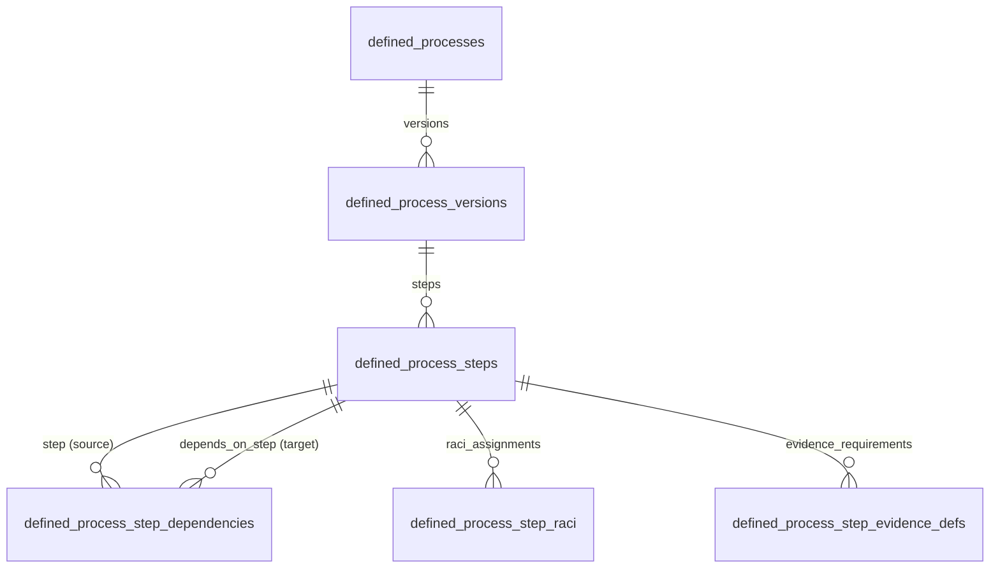

# SNS Projects — DP-1-B Steps, DAG Dependencies, Template RACI & Evidence Definitions Report

**Date:** August 15, 2026  
**Status:** Complete, Live in Production & Regression-Verified  
**Migration File:** `supabase/migrations/20260814190245_defined_process_step_foundation.sql`  
**Migration Version:** `20260814190245`  
**Supabase CLI Version:** `2.114.0`  
**Target Workspace:** `dbcaddf1-cf02-4bad-8af1-974301cdfbea` (SNS Projects)  
**Database Host:** `db.gqerfixdmgbqahgslzsq.supabase.co`  

---

## 1. Executive Summary

The DP-1-B release establishes the second structural layer of the SNS Projects Defined Process Engine, deploying template Steps, DAG Dependency Edges with same-version composite foreign keys, Template RACI Governance, and Evidence Requirement Definitions.

### Core Achievements:
1. **Step Template Table:** `public.defined_process_steps` deployed with sequence ordering, expected duration, governance flags (`approval_required`, `consultation_required`, `evidence_required`, extension notification toggles), and composite key `(id, version_id)`.
2. **Same-Version DAG Dependencies:** `public.defined_process_step_dependencies` deployed with composite foreign keys `(step_id, version_id)` and `(depends_on_step_id, version_id)` referencing `defined_process_steps(id, version_id)`. This structurally prevents cross-version dependency edges at the Postgres engine level.
3. **Template RACI with Max-One Accountable:** `public.defined_process_step_raci` deployed with role check (`R`, `A`, `C`, `I`), partial unique index enforcing at most one `A` per Step, and `response_required` check restricted strictly to `C` (Consulted) assignments.
4. **Evidence Requirement Definitions:** `public.defined_process_step_evidence_defs` deployed supporting V1 evidence types (`file`, `link`, `text`, `reference`).
5. **Least-Privilege Security Model:** All 4 new tables have RLS enabled, direct browser mutations revoked from `anon` and `authenticated`, and member-scoped `SELECT` access granted to `authenticated` users via private active workspace membership verification.
6. **Zero Data Regression:** Zero production rows in all 4 new tables (count `0`). Existing production baseline (3 Projects, 6 Milestones, 12 Task Lists, 24 Tasks, 48 Subtasks, 72 RACI, 0 duplicate positions) remains 100% intact.

---

## 2. Preflight & Migration Ledger

### Preflight Gate:
- Migration list: 7 local == 7 remote (0 pending, 0 orphaned)
- `db push --dry-run`: Remote database is up to date
- Baseline data counts: 3 Projects, 6 Milestones, 12 Task Lists, 24 Tasks, 48 Subtasks, 72 RACI, 0 duplicate position groups

### Post-Deployment Migration List:
```json
{
  "migrations": [
    { "local": "20260814175623", "remote": "20260814175623", "time": "2026-08-14 17:56:23" },
    { "local": "20260814175627", "remote": "20260814175627", "time": "2026-08-14 17:56:27" },
    { "local": "20260814175631", "remote": "20260814175631", "time": "2026-08-14 17:56:31" },
    { "local": "20260814175635", "remote": "20260814175635", "time": "2026-08-14 17:56:35" },
    { "local": "20260814175639", "remote": "20260814175639", "time": "2026-08-14 17:56:39" },
    { "local": "20260814175643", "remote": "20260814175643", "time": "2026-08-14 17:56:43" },
    { "local": "20260814184458", "remote": "20260814184458", "time": "2026-08-14 18:44:58" },
    { "local": "20260814190245", "remote": "20260814190245", "time": "2026-08-14 19:02:45" }
  ],
  "message": "Migrations listed"
}
```
*Total:* **8 local == 8 remote, 0 pending, 0 orphaned.**

---

## 3. Structural Schema & Integrity Architecture



### A. Table: `public.defined_process_steps`
- `id` (uuid, PK, default `gen_random_uuid()`)
- `version_id` (uuid, FK `defined_process_versions(id)` ON DELETE CASCADE)
- `step_code` (text, NOT NULL)
- `title` (text, NOT NULL)
- `description` (text, NULL)
- `sequence_order` (integer, NOT NULL, CHECK `sequence_order >= 1`)
- `expected_duration_days` (integer, NOT NULL, CHECK `expected_duration_days >= 1`)
- `approval_required` (boolean, NOT NULL, DEFAULT `false`)
- `consultation_required` (boolean, NOT NULL, DEFAULT `false`)
- `evidence_required` (boolean, NOT NULL, DEFAULT `false`)
- `notify_c_on_extension` (boolean, NOT NULL, DEFAULT `false`)
- `notify_i_on_extension` (boolean, NOT NULL, DEFAULT `false`)
- `created_at`, `updated_at` (timestamptz)
- **Constraints:**
  - `UNIQUE(version_id, step_code)`
  - `UNIQUE(version_id, sequence_order)`
  - `UNIQUE(id, version_id)` (Composite key for same-version FK reference)

### B. Table: `public.defined_process_step_dependencies`
- `id` (uuid, PK, default `gen_random_uuid()`)
- `version_id` (uuid, FK `defined_process_versions(id)` ON DELETE CASCADE)
- `step_id` (uuid, NOT NULL)
- `depends_on_step_id` (uuid, NOT NULL)
- `created_at` (timestamptz)
- **Same-Version Composite Foreign Keys:**
  - `FOREIGN KEY (step_id, version_id) REFERENCES public.defined_process_steps(id, version_id) ON DELETE CASCADE`
  - `FOREIGN KEY (depends_on_step_id, version_id) REFERENCES public.defined_process_steps(id, version_id) ON DELETE CASCADE`
- **Constraints:**
  - `CHECK (step_id <> depends_on_step_id)` (Self-dependency prohibited)
  - `UNIQUE(version_id, step_id, depends_on_step_id)` (Predecessor lookup & duplicate prevention)
- **Indexes:**
  - `idx_step_deps_downstream` on `(version_id, depends_on_step_id, step_id)` (Downstream reverse traversal)
  - `idx_step_deps_step_version` on `(step_id, version_id)`
  - `idx_step_deps_depends_version` on `(depends_on_step_id, version_id)`

### C. Table: `public.defined_process_step_raci`
- `id` (uuid, PK, default `gen_random_uuid()`)
- `step_id` (uuid, FK `defined_process_steps(id)` ON DELETE CASCADE)
- `raci_role` (text, CHECK `raci_role IN ('R', 'A', 'C', 'I')`)
- `user_id` (uuid, FK `profiles(id)` ON DELETE RESTRICT)
- `response_required` (boolean, DEFAULT `false`)
- `created_at` (timestamptz)
- **Constraints:**
  - `UNIQUE(step_id, raci_role, user_id)`
  - `CHECK (response_required = false OR raci_role = 'C')`
  - `CREATE UNIQUE INDEX uq_step_raci_single_accountable ON public.defined_process_step_raci (step_id) WHERE raci_role = 'A'` (At most one Accountable per Step)
- **Indexes:**
  - `idx_step_raci_step_id` on `(step_id)`
  - `idx_step_raci_user_step` on `(user_id, step_id)` (User impact & profile FK index)

### D. Table: `public.defined_process_step_evidence_defs`
- `id` (uuid, PK, default `gen_random_uuid()`)
- `step_id` (uuid, FK `defined_process_steps(id)` ON DELETE CASCADE)
- `evidence_type` (text, CHECK `evidence_type IN ('file', 'link', 'text', 'reference')`)
- `title` (text, NOT NULL)
- `description` (text, NULL)
- `is_mandatory` (boolean, DEFAULT `true`)
- `created_at`, `updated_at` (timestamptz)
- **Indexes:**
  - `idx_step_evidence_defs_step_id` on `(step_id)`

---

## 4. Deferred Publication-Time Invariants

The following cross-row and graph invariants are intentionally deferred to future publication transactions (`publish_defined_process`) to support iterative draft authoring in Process Builder:

1. **Single Root Step:** A published version must contain exactly one Step with zero predecessor dependencies (the root Step, sequence_order = 1).
2. **DAG Cycle Prohibition:** Complete draft dependency graph must be topologically sorted / acyclic.
3. **Graph Reachability:** Every Step in a published version must be reachable from the root Step.
4. **Mandatory Responsible (R):** Every Step must have >= 1 Responsible assignment.
5. **Mandatory Accountable (A):** Every Step must have exactly 1 Accountable assignment.
6. **R / A Separation under Approval:** If `approval_required = true`, the Accountable user cannot be in the Responsible set for that Step.
7. **Consultation Coherence:** If `consultation_required = true`, at least one Consulted assignment with `response_required = true` must exist.
8. **Active User Membership:** All referenced RACI profiles must be active members of the process workspace at publish time.

---

## 5. Verification & Test Results

### A. Local Clean Replay
- All 8 canonical migrations replayed cleanly in sequence from scratch in an isolated transactional sandbox with **0 errors**.

### B. DP-1-B Test Suite (`scripts/test-defined-process-dp1b.mjs`)
- **Result:** **53 / 53 PASSED**
  - Table existence & schema types for all 4 tables
  - RLS enablement on all 4 tables
  - Zero anon privileges & SELECT-only authenticated privileges
  - Sequence order and expected duration `>= 1` check enforcement
  - Step code & sequence order uniqueness per version
  - Composite `(id, version_id)` key existence
  - Same-version dependency acceptance & self-dependency rejection
  - Duplicate dependency rejection
  - **Cross-version dependency rejection** enforced by composite foreign key
  - Predecessor and downstream reverse dependency indexes
  - RACI role check (`R`, `A`, `C`, `I`) and duplicate assignment rejection
  - Multiple Responsible users allowed & same user multi-role in draft
  - **Max-one Accountable per Step** enforced by partial unique index
  - `response_required` accepted for `C` and rejected for `R`, `A`, `I`
  - User-oriented RACI index existence
  - Evidence type validation (`file`, `link`, `text`, `reference`)
  - Direct authenticated INSERT / UPDATE / DELETE rejection (`42501`)
  - Active member SELECT access granted via RLS policies
  - Zero production rows in all 4 new tables (count `0`)
  - Production dataset baseline preservation (24 tasks, 12 task lists, 72 RACI, 0 duplicate positions)

### C. Full Regression Suite
| Test Suite | Command | Result |
| :--- | :--- | :---: |
| DP-1-A Process Catalog Verification | `node scripts/test-defined-process-dp1a.mjs` | **26 / 26 PASS** |
| DP-1-B Step Foundation Verification | `node scripts/test-defined-process-dp1b.mjs` | **53 / 53 PASS** |
| Kanban DnD Contracts & Isolation | `node scripts/test-kanban-dnd-contracts.mjs` | **18 / 18 PASS** |
| Structured Production Dataset | `node scripts/test-structured-production-data.mjs` | **20 / 20 PASS** |
| Task Experience & Decongestion | `node scripts/test-task-experience-hotfix.mjs` | **13 / 13 PASS** |
| Kanban Board Hydration | `node scripts/test-kanban-board-hydration.mjs` | **15 / 15 PASS** |
| Task List Hierarchy & Lifecycle | `node scripts/test-tasklist-hierarchy-hotfix.mjs` | **17 / 17 PASS** |
| Navigation & Loading UX | `node scripts/test-navigation-loading-ux.mjs` | **32 / 32 PASS** |
| Code Quality / Linter | `npm run lint` | **0 errors** |
| Vite Production Build | `npm run build` | **0 errors** |
| Secret Scan Audit | `node scripts/secret-scan.mjs` | **0 leaked credentials** |

---

## 6. Supabase Security & Performance Advisors

### Security Advisor:
- **Tables Without RLS:** 0 (All 20 public tables protected by RLS).
- **Private Schema Protection:** `private` schema unexposed via PostgREST Data API.
- **Function ACLs:** Default execution revoked; `reorder_kanban_tasks` callable only by `authenticated`.
- **Known Project Warning:** Leaked Password Protection Disabled (pre-existing Auth project-level setting, unrelated to DP-1-B).
- **New DP-1-B Security Warnings:** **0**

### Performance Advisor:
- **Unindexed Foreign Keys:** 0 new unindexed foreign key notices introduced by DP-1-B. All relational FK columns (`version_id`, `step_id`, `depends_on_step_id`, `user_id`) are covered by explicit indexes.
- **Unused Index Notices:** 10 new structural indexes registered on the 4 empty template tables (normal before table population).

---

## 7. Production Dataset Invariant Comparison

| Metric | Pre-DP1 Baseline | Post-DP1-B Live State | Status |
| :--- | :---: | :---: | :---: |
| **Projects** | 3 | 3 | Identical |
| **Milestones** | 6 | 6 | Identical |
| **Task Lists** | 12 | 12 | Identical |
| **Tasks** | 24 | 24 | Identical |
| **Subtasks** | 48 | 48 | Identical |
| **RACI Assignments** | 72 | 72 | Identical |
| **Duplicate Kanban Positions** | 0 | 0 | Clean |
| **Defined Processes** | 0 | 0 | Clean |
| **Defined Process Versions** | 0 | 0 | Clean |
| **Defined Process Steps** | 0 | 0 | Clean |
| **Step Dependencies** | 0 | 0 | Clean |
| **Step RACI Assignments** | 0 | 0 | Clean |
| **Step Evidence Definitions** | 0 | 0 | Clean |
| **reorder_kanban_tasks** | 4-arg, INVOKER | 4-arg, INVOKER | Identical |

---

## 8. Gate Readiness for DP-1-C
- **DP-1-B Status:** **COMPLETE & VERIFIED**
- **DP-1-C Readiness:** **READY**
