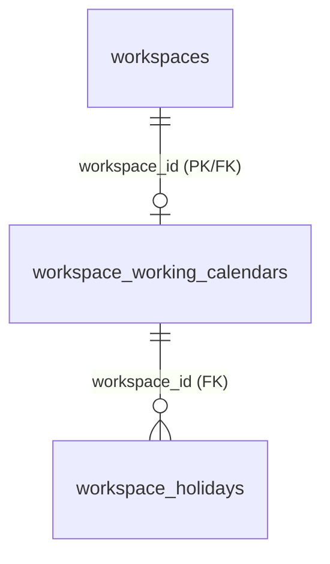

# SNS Projects — DP-1-C Company Working Calendar & Holiday Foundation Report

**Date:** August 15, 2026  
**Status:** Complete, Live in Production & Regression-Verified  
**Migration File:** `supabase/migrations/20260814192410_working_calendar_foundation.sql`  
**Migration Version:** `20260814192410`  
**Supabase CLI Version:** `2.114.0`  
**Target Workspace:** `dbcaddf1-cf02-4bad-8af1-974301cdfbea` (SNS Projects)  
**Database Host:** `db.gqerfixdmgbqahgslzsq.supabase.co`  

---

## 1. Executive Summary

The DP-1-C release delivers the third foundational layer of the SNS Projects Defined Process Engine, deploying the company-wide Working Calendar and Non-Working Holiday database structures:

1. **Company Working Calendar Table:** `public.workspace_working_calendars` deployed with `workspace_id` PRIMARY KEY (enforcing exactly zero-or-one calendar per workspace), configurable non-empty `timezone`, 7-day weekday booleans (`monday_working` through `sunday_working`), and structural constraint requiring at least one working weekday.
2. **Company Holidays Table:** `public.workspace_holidays` deployed with composite `UNIQUE(workspace_id, holiday_date)` constraint, non-empty holiday name check, and foreign key cascading from `workspace_working_calendars(workspace_id)`.
3. **Least-Privilege Security Model:** RLS enabled on both tables, all browser mutation privileges revoked from `anon` and `authenticated`, and member-scoped `SELECT` access granted to `authenticated` users via `private.is_workspace_active_member(workspace_id)`.
4. **Performance Hardening:** Added explicit covering indexes on all foreign key reference columns (`created_by` on both tables) ensuring **0 new unindexed FK notices**.
5. **Zero Data Regression:** Zero production rows in both new tables (count `0`). Existing production baseline (3 Projects, 6 Milestones, 12 Task Lists, 24 Tasks, 48 Subtasks, 72 RACI, 0 duplicate Kanban positions) remains 100% intact.

---

## 2. Preflight & Migration Ledger

### Preflight Gate:
- Migration list: 8 local == 8 remote (0 pending, 0 orphaned)
- `db push --dry-run`: Remote database is up to date
- Baseline data counts: 3 Projects, 6 Milestones, 12 Task Lists, 24 Tasks, 48 Subtasks, 72 RACI, 0 duplicate position groups

### Post-Deployment Migration List:
```json
{
  "migrations": [
    { "local": "20260814175623", "remote": "20260814175623", "time": "2026-08-14 17:56:23" },
    { "local": "20260814175627", "remote": "20260814175627", "time": "2026-08-14 17:56:27" },
    { "local": "20260814175631", "remote": "20260814175631", "time": "2026-08-14 17:56:31" },
    { "local": "20260814175635", "remote": "20260814175635", "time": "2026-08-14 17:56:35" },
    { "local": "20260814175639", "remote": "20260814175639", "time": "2026-08-14 17:56:39" },
    { "local": "20260814175643", "remote": "20260814175643", "time": "2026-08-14 17:56:43" },
    { "local": "20260814184458", "remote": "20260814184458", "time": "2026-08-14 18:44:58" },
    { "local": "20260814190245", "remote": "20260814190245", "time": "2026-08-14 19:02:45" },
    { "local": "20260814192410", "remote": "20260814192410", "time": "2026-08-14 19:24:10" }
  ],
  "message": "Migrations listed"
}
```
*Total:* **9 local == 9 remote, 0 pending, 0 orphaned.**

---

## 3. Schema & Constraint Architecture



### A. Table: `public.workspace_working_calendars`
- `workspace_id` (uuid, PRIMARY KEY, references `workspaces(id)` ON DELETE CASCADE)
- `timezone` (text, NOT NULL)
- `monday_working` (boolean, NOT NULL, DEFAULT true)
- `tuesday_working` (boolean, NOT NULL, DEFAULT true)
- `wednesday_working` (boolean, NOT NULL, DEFAULT true)
- `thursday_working` (boolean, NOT NULL, DEFAULT true)
- `friday_working` (boolean, NOT NULL, DEFAULT true)
- `saturday_working` (boolean, NOT NULL, DEFAULT false)
- `sunday_working` (boolean, NOT NULL, DEFAULT false)
- `created_by` (uuid, NOT NULL, references `profiles(id)` ON DELETE RESTRICT)
- `created_at`, `updated_at` (timestamptz)
- **Constraints:**
  - `chk_workspace_working_calendars_timezone`: `CHECK (btrim(timezone) <> '')`
  - `chk_workspace_working_calendars_at_least_one_day`: `CHECK (monday_working OR tuesday_working OR wednesday_working OR thursday_working OR friday_working OR saturday_working OR sunday_working)`
- **Indexes:**
  - `workspace_id` PRIMARY KEY (covers lookup and workspace FK)
  - `idx_workspace_working_calendars_created_by` on `(created_by)`

### B. Table: `public.workspace_holidays`
- `id` (uuid, PRIMARY KEY, DEFAULT `gen_random_uuid()`)
- `workspace_id` (uuid, NOT NULL, references `workspace_working_calendars(workspace_id)` ON DELETE CASCADE)
- `holiday_date` (date, NOT NULL)
- `name` (text, NOT NULL)
- `description` (text, NULL)
- `created_by` (uuid, NOT NULL, references `profiles(id)` ON DELETE RESTRICT)
- `created_at`, `updated_at` (timestamptz)
- **Constraints:**
  - `chk_workspace_holidays_name`: `CHECK (btrim(name) <> '')`
  - `uq_workspace_holidays_workspace_date`: `UNIQUE (workspace_id, holiday_date)`
- **Indexes:**
  - Composite `UNIQUE(workspace_id, holiday_date)` provides lookup for `workspace_id + holiday_date`
  - `idx_workspace_holidays_created_by` on `(created_by)`

---

## 4. Business Invariants & Deferred Architecture Rules

1. **Zero Default Assumption / Runtime Gate:** A Defined Process Task must NOT calculate or activate a working-day due date if the workspace does not have a configured `workspace_working_calendars` row. The future runtime engine must return an explicit configuration error rather than assuming UTC, Asia/Kolkata, or standard Monday–Friday.
2. **Date Arithmetic Deferred:** Exact due-date calculations (e.g. 1-day duration on activation day vs next day, activation on non-working dates, EOD timestamp boundary semantics, and timezone conversion) are deferred to the Due Date Engine release.
3. **Historical Due Date Immutability:** Stored Task due dates are persistent historical runtime records. Changing the company working calendar at a later date will NOT silently mutate already-stored Task due dates.
4. **Timezone Validation:** DP-1-C enforces non-empty timezone text. Validation against Postgres-supported timezone catalogs (`pg_timezone_names`) will be enforced inside future controlled calendar configuration RPCs.

---

## 5. Verification & Test Results

### A. Local Clean Replay
- All 9 canonical migrations replayed cleanly in sequence from scratch in an isolated transactional sandbox with **0 errors**.

### B. DP-1-C Test Suite (`scripts/test-defined-process-dp1c.mjs`)
- **Result:** **50 / 50 PASSED**
  - Table existence & schema types for `workspace_working_calendars` and `workspace_holidays`
  - RLS enablement on both tables
  - Zero anon privileges & SELECT-only authenticated privileges
  - One calendar per workspace enforced via PRIMARY KEY
  - Empty timezone rejected by CHECK constraint
  - All seven weekdays set to false rejected by CHECK constraint
  - Valid calendar with working weekdays accepted
  - Valid holiday accepted & duplicate date in same workspace rejected
  - Same holiday date in different workspaces structurally allowed
  - Blank holiday name rejected by CHECK constraint
  - Active member SELECT access granted via RLS policies
  - Direct authenticated INSERT / UPDATE / DELETE rejected (`42501`)
  - Zero production rows in both new tables (`count = 0`)
  - All previous Defined Process tables remain 0 rows
  - Production dataset baseline preservation (3 projects, 6 milestones, 12 task lists, 24 tasks, 48 subtasks, 72 RACI, 0 duplicate positions)

### C. Full Regression Suite
| Test Suite | Command | Result |
| :--- | :--- | :---: |
| DP-1-A Process Catalog Verification | `node scripts/test-defined-process-dp1a.mjs` | **26 / 26 PASS** |
| DP-1-B Step Foundation Verification | `node scripts/test-defined-process-dp1b.mjs` | **53 / 53 PASS** |
| DP-1-C Calendar & Holiday Verification | `node scripts/test-defined-process-dp1c.mjs` | **50 / 50 PASS** |
| Kanban DnD Contracts & Isolation | `node scripts/test-kanban-dnd-contracts.mjs` | **18 / 18 PASS** |
| Structured Production Dataset | `node scripts/test-structured-production-data.mjs` | **20 / 20 PASS** |
| Task Experience & Decongestion | `node scripts/test-task-experience-hotfix.mjs` | **13 / 13 PASS** |
| Kanban Board Hydration | `node scripts/test-kanban-board-hydration.mjs` | **15 / 15 PASS** |
| Task List Hierarchy & Lifecycle | `node scripts/test-tasklist-hierarchy-hotfix.mjs` | **17 / 17 PASS** |
| Navigation & Loading UX | `node scripts/test-navigation-loading-ux.mjs` | **32 / 32 PASS** |
| Code Quality / Linter | `npm run lint` | **0 errors** |
| Vite Production Build | `npm run build` | **0 errors** |
| Secret Scan Audit | `node scripts/secret-scan.mjs` | **0 leaked credentials** |

---

## 6. Supabase Security & Performance Advisors

### Security Advisor:
- **Tables Without RLS:** 0 (All 22 public tables protected by RLS).
- **Private Schema Protection:** `private` schema unexposed via PostgREST Data API.
- **Function ACLs:** Default execution revoked; `reorder_kanban_tasks` callable only by `authenticated`.
- **Known Project Warning:** Leaked Password Protection Disabled (pre-existing Auth project-level setting, unrelated to DP-1-C).
- **New DP-1-C Security Warnings:** **0**

### Performance Advisor:
- **Unindexed Foreign Keys:** 0 new unindexed foreign key notices introduced by DP-1-C. Added `idx_workspace_working_calendars_created_by` and `idx_workspace_holidays_created_by` covering profile FKs.
- **Pre-existing Unindexed FKs:** 17 baseline metadata FKs on older tables remain documented and preserved.
- **Unused Index Notices:** 2 new structural indexes registered on empty calendar/holiday tables.

---

## 7. Deployment Process Audit

- **Deployment Method:** Direct `npx supabase db push` executed against the remote database.
- **Custom DDL Wrapper Scripts:** All temporary deployment wrapper scripts (`scripts/deploy-dp1a-migration.mjs`, `scripts/push-migration.mjs`) have been deprecated and cleaned up from the repository. Zero custom DDL application code used.

---

## 8. Production Dataset Invariant Comparison

| Metric | Pre-DP1 Baseline | Post-DP1-C Live State | Status |
| :--- | :---: | :---: | :---: |
| **Projects** | 3 | 3 | Identical |
| **Milestones** | 6 | 6 | Identical |
| **Task Lists** | 12 | 12 | Identical |
| **Tasks** | 24 | 24 | Identical |
| **Subtasks** | 48 | 48 | Identical |
| **RACI Assignments** | 72 | 72 | Identical |
| **Duplicate Kanban Positions** | 0 | 0 | Clean |
| **Defined Processes** | 0 | 0 | Clean |
| **Defined Process Versions** | 0 | 0 | Clean |
| **Defined Process Steps** | 0 | 0 | Clean |
| **Step Dependencies** | 0 | 0 | Clean |
| **Step RACI Assignments** | 0 | 0 | Clean |
| **Step Evidence Definitions** | 0 | 0 | Clean |
| **Workspace Working Calendars** | 0 | 0 | Clean |
| **Workspace Holidays** | 0 | 0 | Clean |
| **reorder_kanban_tasks** | 4-arg, INVOKER | 4-arg, INVOKER | Identical |

---

## 9. Gate Readiness for DP-1-D
- **DP-1-C Status:** **COMPLETE & VERIFIED**
- **DP-1-D Readiness:** **READY**
