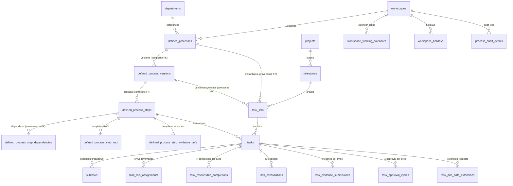
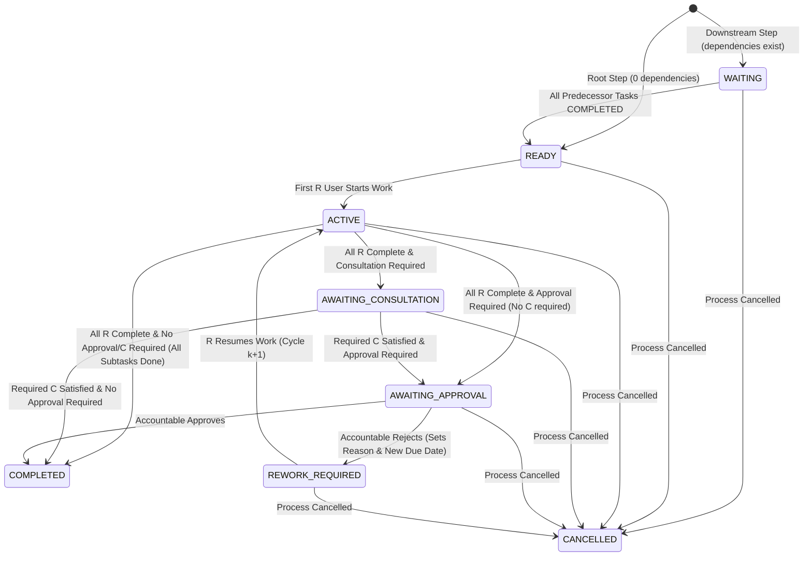

# SNS Projects — Defined Process Engine (DP-0 & DP-0.1)
## Architecture Blueprint & Comprehensive Database Plan

**Project:** Stack n Stock Projects (SNS Projects V2)  
**Production Workspace ID:** `dbcaddf1-cf02-4bad-8af1-974301cdfbea`  
**Target Database:** Supabase Postgres (`gqerfixdmgbqahgslzsq`)  
**Phase:** DP-0 Pre-Flight Analysis & DP-0.1 Architecture Correction Pass  
**Status:** ARCHITECTURE ONLY (No database mutations, no code changes, no schema applied, no deployment)  

---

## 1. Executive Architecture Decision

### 1.1 Canonical Hierarchy & Object Mapping
The Defined Process Engine directly maps to the existing 5-level organizational hierarchy without creating a parallel task or instance ecosystem:

```
Workspace
 └── Project
      └── Milestone
           └── Task List (type = 'custom' OR 'defined') [Process Instance]
                └── Task (workflow_state: WAITING | READY | ACTIVE | ...) [Step Instance]
                     └── Subtask (optional execution breakdown)
```

1. **`task_lists` is the Canonical Process Instance Object:**
   - Custom Task Lists (`task_list_type = 'custom'`): Standard manual task lists. No dependency automation, no duration engine, no approval gates.
   - Defined Task Lists (`task_list_type = 'defined'`): Live instances instantiated from an approved, published `defined_process_version`. Carries full process provenance (`defined_process_id`, `defined_process_version_id`, `process_state`, `process_owner_id`, `started_by`, `started_at`, etc.).
2. **`tasks` are Live Step Instances:**
   - All Defined Process tasks are generated immediately at process instantiation and stored as normal rows in `public.tasks`.
   - Each task carries `workflow_state` (`WAITING`, `READY`, `ACTIVE`, `AWAITING_CONSULTATION`, `AWAITING_APPROVAL`, `REWORK_REQUIRED`, `COMPLETED`, `CANCELLED`).
   - Standard Kanban column status (`status_id`) is automatically synchronized by the engine to represent operational progress (`todo`, `in_progress`, `in_review`, `blocked`, `done`).
3. **`subtasks` are Execution Breakdowns:**
   - Subtasks remain optional task-level checklists.
   - **Gating Rule:** If a task contains subtasks, 100% of subtasks must have `status = 'done'` before the task can advance to Accountable approval or terminal completion. Subtasks do NOT receive independent RACI/dependency workflow engines.
4. **`task_raci_assignments` is Canonical RACI:**
   - Template RACI is copied to `task_raci_assignments` upon instantiation (with support for instance overrides).
   - Reused across all existing views (My Work, Task Detail, Dashboard).

---

## 2. Current Production Schema & Baseline Findings

### 2.1 Production Baseline (`dbcaddf1-cf02-4bad-8af1-974301cdfbea`)
- **Projects:** 3 (`ASRS Product Development`, `SNS Projects Internal Rollout`, `Warehouse Deployment Pilot`)
- **Milestones:** 6 (2 per project)
- **Task Lists:** 12 (4 per project, 2 per milestone)
- **Tasks:** 24 (8 per project, 2 per task list)
- **Subtasks:** 48 (2 per task)
- **Task RACI Assignments:** 72 (3 per task: 1 Accountable, 1 Responsible, 1 Consulted/Informed)
- **Notifications:** 0 (clean inbox)
- **Task Statuses:** 15 (5 per project: `todo`, `in_progress`, `in_review`, `blocked`, `done`)
- **Departments:** 5 core (`ENG`, `SWIT`, `OPS`, `PROC`, `COMM`)

### 2.2 Security Architecture Baseline
- `private` schema contains security helpers: `private.is_workspace_active_member()`, `private.can_administer_workspace()`, `private.get_user_workspace_role()`, `private.has_system_role()`.
- Default privileges on `public` and `private` are revoked from `PUBLIC` and `anon`.
- RLS is strictly enabled across all 13 existing public tables.
- `public.reorder_kanban_tasks` is configured as `SECURITY INVOKER` with explicit grant to `authenticated` only.

---

## 3. Pre-Existing Kanban Integrity Blocker

### Live Diagnostic Findings
A direct database query reveals **4 duplicate task-position groups** in production Kanban data:

| Project | Status | System Code | Position | Duplicate Count | Task Titles |
|---|---|---|---|---|---|
| **SNS Projects Internal Rollout** | In Progress | `in_progress` | `0` | 2 | "Configure System Roles", "Close P0 / P1 Application Defects" |
| **SNS Projects Internal Rollout** | To Do | `todo` | `1` | 2 | "Publish Quick User Guide & BAU Handover", "Run Team Walkthrough" |
| **Warehouse Deployment Pilot** | Done | `done` | `2000` | 3 | "Mobilize External Vendors", "Complete Mechanical Installation", "Freeze Site Layout" |
| **Warehouse Deployment Pilot** | To Do | `todo` | `2000` | 3 | "Commission PLC & HMI", "Complete Site Acceptance Test", "Train Operations Team & Go Live" |

> [!WARNING]
> **PRE-EXISTING KANBAN INTEGRITY BLOCKER**  
> Before the Defined Process production migration (DP-1) is applied, an independent data-normalization script must be run to re-space all existing Kanban task positions (1000, 2000, 3000...) within their respective `(project_id, status_id)` columns. This blocker must be closed separately and not mixed into the DP-1 schema migration.

---

## 4. DP-0.1 Architecture Corrections & Resolutions

### 4.1 Resolution of Security Invoker vs. Privileged Write Contradiction
- **Problem Statement:** In the existing production database, `private.emit_notification()` is `SECURITY DEFINER`, and direct `INSERT` on `public.notifications` is revoked from `authenticated` and `anon`. Similarly, `public.process_audit_events` is designed to be immutable and browser read-only (direct `INSERT` revoked from `authenticated`). Therefore, a `SECURITY INVOKER` RPC running with client privileges cannot write audit logs or notifications without failing RLS/privilege checks.
- **Architectural Solution (Option A Chosen & Justified):**
  - All multi-table Defined Process workflow transition RPCs (`start_defined_process`, `approve_process_task`, `reject_process_task`, `complete_responsible_part`, `cancel_process_instance`, etc.) are implemented as **Strict `SECURITY DEFINER` functions** with `SET search_path = ''`.
  - **Internal Semantic Authorization:** Every RPC strictly begins by inspecting `auth.uid()`, validating workspace active membership, and checking specific domain permissions (e.g. verifying `auth.uid()` matches the assigned Accountable user for `approve_process_task`, or verifying `auth.uid()` is an assigned Responsible user for `complete_responsible_part`).
  - **Single Transactional Boundary:** Executing as `SECURITY DEFINER` allows the RPC to atomically update `tasks.workflow_state`, update `tasks.status_id`, insert rows into `task_approval_cycles` / `task_responsible_completions`, write immutable audit logs to `public.process_audit_events`, and invoke `private.emit_notification()` in a single transactional unit without granting `authenticated` direct insert privileges on protected audit/notification tables.
  - **Privilege Grants:** Default privileges revoked from `PUBLIC` and `anon`. Explicit `GRANT EXECUTE ON FUNCTION ... TO authenticated`.

### 4.2 Protection of Defined Process Tasks from Manual Workflow Bypass
- **Problem Statement:** If normal `tasks` table updates or Kanban drag-and-drop operations remain unrestricted, users could drag a `WAITING` task to `Done`, or manually update `status_id = done_id` without completing subtasks, evidence, consultations, or Accountable approvals.
- **Architectural Solution:**
  1. **Database Trigger Guard (`public.trg_fn_protect_defined_tasks`):**
     - Attached `BEFORE UPDATE ON public.tasks FOR EACH ROW`.
     - Inspects whether `NEW.task_list_id` belongs to a defined task list (`task_list_type = 'defined'`):
       - If `current_setting('app.workflow_mutation', true) = 'true'` (set internally inside trusted workflow RPCs), mutations are permitted.
       - Otherwise (direct client update via Supabase Data API):
         - Strictly forbids direct modification of workflow-controlled fields: `workflow_state`, `status_id`, `milestone_id`, `task_list_id`, `due_date`, `duration_working_days`, `process_step_id`, `approval_cycle_count`.
         - Raises SQL exception: `'Direct modification of workflow-controlled fields on Defined Process tasks is prohibited. Use workflow action RPCs.'`.
         - Allows normal editing of purely operational/descriptive fields: `description`, `priority` (display priority).
  2. **Kanban Reorder RPC Guard (`public.reorder_kanban_tasks`):**
     - Updated to inspect `v_task.workflow_state`:
       - If `v_task.workflow_state IS NOT NULL` (Defined Task):
         - Reordering within the *same* status column (`p_new_status_id = v_task.status_id`) is allowed (adjusts card sequence).
         - Moving across different status columns (`p_new_status_id != v_task.status_id`) is strictly REJECTED with exception: `'Defined Process tasks cannot be moved across status columns manually. Use workflow action buttons.'`.
       - If `v_task.workflow_state IS NULL` (Custom Task): Existing unconstrained Kanban drag-and-drop behavior is 100% preserved.

### 4.3 Operational Status vs. Workflow State (Cancelled & Blocked Strategy)
- **Production Status System Codes:** Live database has exactly 5 system codes: `todo`, `in_progress`, `in_review`, `blocked`, `done`. There is NO `cancelled` row in `task_statuses`.
- **Cancellation Strategy (Option B Chosen):**
  - Cancellation is maintained purely in the process engine layer: `task_lists.process_state = 'cancelled'` and `tasks.workflow_state = 'CANCELLED'`.
  - No synthetic `cancelled` status is added to `task_statuses`.
  - Tasks in `workflow_state = 'CANCELLED'` preserve their last operational `status_id`, but are excluded from active Kanban boards, My Work action tabs, and completion metrics via query filters (`workflow_state != 'CANCELLED'`).
- **Blocked Semantics:**
  - `blocked` is an operational condition (`task_statuses.system_code = 'blocked'`).
  - A Defined Task in `workflow_state = 'ACTIVE'`, `'READY'`, or `'REWORK_REQUIRED'` can have its operational status updated to `blocked` (e.g. parts delayed, external vendor unavailable).
  - Downstream dependent tasks remain `WAITING`.
  - Operational status `blocked` does NOT alter `workflow_state`.
- **State Compatibility Matrix:**

| `workflow_state` | Operational Kanban `system_code` | Allowed? | Operational Meaning & Trigger |
|---|---|---|---|
| `WAITING` | `todo` | **YES** | Predecessors incomplete. Task locked in To Do. |
| `WAITING` | `in_progress`, `in_review`, `blocked`, `done` | **NO** | Blocked by trigger guard. |
| `READY` | `todo` | **YES** | Predecessors complete, due date calculated, ready for R to start. |
| `READY` | `blocked` | **YES** | Step ready, but operationally blocked before work begins. |
| `ACTIVE` | `in_progress` | **YES** | R user is actively executing the step. |
| `ACTIVE` | `blocked` | **YES** | Work active, but blocked on external dependency. |
| `AWAITING_CONSULTATION` | `in_review` | **YES** | R complete; awaiting required Consulted feedback. |
| `AWAITING_CONSULTATION` | `blocked` | **YES** | Consultation active but blocked. |
| `AWAITING_APPROVAL` | `in_review` | **YES** | All R, C, evidence, subtasks complete; awaiting Accountable decision. |
| `AWAITING_APPROVAL` | `blocked` | **YES** | Approval pending but blocked. |
| `REWORK_REQUIRED` | `in_progress` | **YES** | Accountable rejected; R revising work (visual rework badge). |
| `REWORK_REQUIRED` | `blocked` | **YES** | Rework required, but blocked. |
| `COMPLETED` | `done` | **YES** | Terminal step completion. Unlocks downstream dependent steps. |
| `CANCELLED` | Preserves previous status | **YES** | Parent process cancelled. Excluded from active views. |

### 4.4 Same-Version Dependency Enforcement
- **Structural Integrity Model:**
  - `defined_process_step_dependencies` carries `version_id uuid NOT NULL`.
  - `defined_process_steps` has unique constraint: `UNIQUE(id, version_id)`.
  - `defined_process_step_dependencies` enforces composite foreign keys:
    ```sql
    CONSTRAINT fk_dep_step FOREIGN KEY (step_id, version_id)
      REFERENCES public.defined_process_steps(id, version_id) ON DELETE CASCADE,
    CONSTRAINT fk_dep_depends_on FOREIGN KEY (depends_on_step_id, version_id)
      REFERENCES public.defined_process_steps(id, version_id) ON DELETE CASCADE,
    CONSTRAINT chk_dep_no_self CHECK (step_id <> depends_on_step_id),
    CONSTRAINT uq_dep_step_pair UNIQUE (step_id, depends_on_step_id)
    ```
  - This structurally guarantees at the PostgreSQL engine level that dependencies cannot cross between different versions!
  - Cycle detection is strictly validated via DFS in `publish_defined_process` before publication.

### 4.5 Process / Version Provenance Enforcement
- **Structural Integrity on `task_lists`:**
  - `defined_process_versions` has unique constraint: `UNIQUE(id, defined_process_id)`.
  - `public.task_lists` enforces composite foreign key:
    ```sql
    CONSTRAINT fk_task_lists_process_version FOREIGN KEY (defined_process_version_id, defined_process_id)
      REFERENCES public.defined_process_versions(id, defined_process_id) ON DELETE RESTRICT
    ```
  - This guarantees that a Defined Task List cannot reference a version ID belonging to a different process ID.
- **Step to Version Integrity on `tasks`:**
  - In `start_defined_process`, tasks are inserted in bulk directly from `defined_process_steps` matching `p_process_version_id`.
  - Direct updates to `tasks.process_step_id` are prohibited by `trg_fn_protect_defined_tasks`.

### 4.6 Audit & Historical Provenance Immutability (Hard-Delete Protection)
- **Delete Constraints:**
  - Published versions (`defined_process_versions` where `status IN ('published', 'archived')`): `ON DELETE RESTRICT` on all references.
  - Instantiated Defined Processes: Cannot be hard-deleted if referenced by any `task_lists` row (`ON DELETE RESTRICT`). Must be archived (`is_active = false`).
  - Defined Task Lists: Cannot be hard-deleted. Must be transitioned to `process_state = 'completed'` or `'cancelled'`.
  - `process_audit_events`: Retains foreign keys with `ON DELETE RESTRICT` for `task_list_id` and `ON DELETE SET NULL` for `task_id`.
- **RLS Policy Update on `task_lists` DELETE:**
  ```sql
  DROP POLICY IF EXISTS "task_lists_delete_member" ON public.task_lists;
  CREATE POLICY "task_lists_delete_member" ON public.task_lists FOR DELETE TO authenticated
    USING (
      task_list_type = 'custom'
      AND EXISTS (
        SELECT 1 FROM public.projects p
        WHERE p.id = task_lists.project_id
          AND (
            private.get_user_workspace_role(p.workspace_id) IN ('owner', 'admin')
            OR private.has_system_role(p.workspace_id, 'system_admin')
            OR private.has_system_role(p.workspace_id, 'project_admin')
          )
      )
    );
  ```

### 4.7 Modeling Custom &rarr; Defined Process Conversion Governance
- **Distinction between Normal Department SOPs and Converted Custom Task Lists:**
  - **Normal Department SOP:**
    - `source_type = 'manual'`.
    - Created/drafted by Process Owner (`process_owner_id`).
    - Publish Authority: Department Head (`role = 'head'` in `department_memberships`) OR Project Admin (`project_admin` in `user_system_roles`) OR System Admin (`system_admin` / `owner`).
  - **Custom Task List Conversion:**
    - User clicks "Save as Defined Process" on a custom task list (`source_type = 'custom_conversion'`, `source_task_list_id`).
    - Generates Draft V1.
    - **Publish Authority:** STRICTLY requires Project Administrator (`project_admin`) OR System Administrator (`system_admin` / `owner`). Department Head alone CANNOT publish a converted custom task list without Project/System Admin approval.
- **Data Model on `public.defined_processes`:**
  - `source_type text NOT NULL DEFAULT 'manual' CHECK (source_type IN ('manual', 'custom_conversion'))`
  - `source_task_list_id uuid REFERENCES public.task_lists(id) ON DELETE SET NULL`
  - `approval_state text CHECK (approval_state IN ('not_required', 'pending_approval', 'approved', 'rejected')) DEFAULT 'not_required'`
  - `submitted_for_approval_by uuid REFERENCES public.profiles(id)`
  - `submitted_for_approval_at timestamptz`
  - `approval_decided_by uuid REFERENCES public.profiles(id)`
  - `approval_decided_at timestamptz`
  - `approval_notes text`

### 4.8 Deterministic Root / Start Step Rule & Caller Validation
- **Deterministic Start Rule:**
  - Every published Defined Process Version must have **exactly ONE root step** (a step with 0 dependencies, `sequence_order = 1`). Validated in `publish_defined_process`.
  - Root Step represents Step 1. Completing Step 1 unlocks 1 to N downstream steps (parallel DAG).
- **Caller Validation in `start_defined_process`:**
  - Resolves template RACI for Step 1, merges any instance RACI overrides passed in `p_raci_overrides`, and evaluates:
    $$\text{auth.uid()} \in \text{final\_responsible\_user\_ids(Step 1)}$$
  - If `auth.uid()` is NOT one of the assigned Responsible users for Step 1, the launch is REJECTED with exception: `'Only an assigned Responsible user for Step 1 can launch this Defined Process'`.
  - Project Admin / System Admin can launch on behalf of the team if explicitly authorized.

### 4.9 Mandatory vs. Informational Consulted (`C`) Users
- **Data Model on `defined_process_step_raci`:**
  - `response_required boolean NOT NULL DEFAULT false`
  - Constraint: `CHECK (raci_role = 'C' OR response_required = false)` (only C can have `response_required = true`).
- **Workflow Execution Rule:**
  - If Step `consultation_required = true`:
    - At least one C user with `response_required = true` MUST be assigned.
    - When all R complete, task enters `AWAITING_CONSULTATION`.
    - **Blocking Gate:** Only responses from `response_required = true` Consulted users are required to advance the task.
    - Informational C users (`response_required = false`) receive notifications and visibility, but do not block progression.

### 4.10 Cycle-Aware Overdue Tracking
- **Problem Statement:** Storing a single `overdue_notified_at` suppresses overdue alerts on subsequent rework cycles if a task is rejected by Accountable and crosses its *new* due date.
- **Architectural Solution:**
  - On `public.tasks`:
    - `current_cycle_number integer NOT NULL DEFAULT 1`
    - `overdue_cycle_notified integer NOT NULL DEFAULT 0`
  - When `due_date < current_date` AND `workflow_state NOT IN ('COMPLETED', 'CANCELLED')` AND `overdue_cycle_notified < current_cycle_number`:
    - Emit single overdue notification to R, A, C, I.
    - Update `overdue_cycle_notified = current_cycle_number`.
    - Record `TASK_OVERDUE` event in `process_audit_events` with `current_cycle_number`.
  - When Accountable rejects and sets a new due date:
    - `current_cycle_number` increments ($k \to k + 1$).
    - `overdue_cycle_notified` remains at $k$. If the new due date is breached, exactly ONE new notification will fire for cycle $k+1$.

### 4.11 Pending Due Date Extension Uniqueness & Lifecycle
- **Uniqueness Constraint:**
  ```sql
  CREATE UNIQUE INDEX uq_task_pending_extension
    ON public.task_due_date_extensions(task_id)
    WHERE decision = 'pending';
  ```
  Guarantees at most 1 pending due date extension request per task at any time.
- **Lifecycle on Task Completion / Cancellation:**
  - If a task reaches `COMPLETED` or `CANCELLED` while an extension request is pending:
    - The workflow RPC automatically sets `decision = 'cancelled'`, `decided_at = now()`, `decision_notes = 'Auto-closed due to task completion/cancellation'`.

### 4.12 Deactivated Users Validation
- **Template Publishing Validation (`publish_defined_process`):**
  - Verifies 100% of user IDs in `defined_process_step_raci` exist in `profiles` and are active members in `workspace_members` (`status = 'active'`). Rejects publication if any user is inactive.
- **Process Start Validation (`start_defined_process`):**
  - Verifies all resolved RACI users (after overrides) are active members of the workspace.
- **Master RACI Propagation (`apply_process_version_to_instances`):**
  - Replaces RACI on all unfinished tasks with new template RACI, strictly validating that replacement users are active.

---

## 5. Existing Tables Reused (12 Tables)

The Defined Process Engine reuses the existing operational infrastructure:
1. `public.workspaces` (Organization boundary)
2. `public.workspace_members` (Membership & workspace roles: `owner`, `admin`, `member`, `viewer`)
3. `public.user_system_roles` (Executive roles: `ceo`, `cto`, `project_admin`, `system_admin`)
4. `public.departments` (Process library categorization)
5. `public.department_memberships` (Department roles: `head`, `lead`, `member`)
6. `public.projects` (Strategic project containers)
7. `public.milestones` (Project milestone stages)
8. `public.task_statuses` (Operational Kanban column statuses: `todo`, `in_progress`, `in_review`, `blocked`, `done`)
9. `public.subtasks` (Task execution checklists)
10. `public.profiles` (User identity)
11. `public.notifications` (Notification inbox via `private.emit_notification()`)
12. `public.task_raci_assignments` (Runtime RACI matrix)

---

## 6. Existing Tables to Alter (2 Tables)

### A. `public.task_lists`
```sql
ALTER TABLE public.task_lists
  ADD COLUMN task_list_type text NOT NULL DEFAULT 'custom' CHECK (task_list_type IN ('custom', 'defined')),
  ADD COLUMN defined_process_id uuid REFERENCES public.defined_processes(id) ON DELETE RESTRICT,
  ADD COLUMN defined_process_version_id uuid REFERENCES public.defined_process_versions(id) ON DELETE RESTRICT,
  ADD COLUMN process_state text CHECK (process_state IS NULL OR process_state IN ('active', 'completed', 'cancelled')),
  ADD COLUMN process_owner_id uuid REFERENCES public.profiles(id) ON DELETE SET NULL,
  ADD COLUMN started_by uuid REFERENCES public.profiles(id) ON DELETE SET NULL,
  ADD COLUMN started_at timestamptz,
  ADD COLUMN completed_at timestamptz,
  ADD COLUMN cancelled_at timestamptz,
  ADD COLUMN cancelled_by uuid REFERENCES public.profiles(id) ON DELETE SET NULL,
  ADD COLUMN cancellation_reason text;

ALTER TABLE public.task_lists
  ADD CONSTRAINT chk_task_list_defined_provenance CHECK (
    (task_list_type = 'custom' AND defined_process_id IS NULL AND process_state IS NULL)
    OR
    (task_list_type = 'defined' AND defined_process_id IS NOT NULL AND process_state IS NOT NULL AND started_at IS NOT NULL)
  );

ALTER TABLE public.task_lists
  ADD CONSTRAINT fk_task_lists_process_version FOREIGN KEY (defined_process_version_id, defined_process_id)
    REFERENCES public.defined_process_versions(id, defined_process_id) ON DELETE RESTRICT;

CREATE INDEX idx_task_lists_type ON public.task_lists(task_list_type);
CREATE INDEX idx_task_lists_process_state ON public.task_lists(process_state) WHERE process_state IS NOT NULL;
CREATE INDEX idx_task_lists_process_lookup ON public.task_lists(defined_process_id, defined_process_version_id);
```

### B. `public.tasks`
```sql
ALTER TABLE public.tasks
  ADD COLUMN workflow_state text CHECK (workflow_state IS NULL OR workflow_state IN (
    'WAITING',
    'READY',
    'ACTIVE',
    'AWAITING_CONSULTATION',
    'AWAITING_APPROVAL',
    'REWORK_REQUIRED',
    'COMPLETED',
    'CANCELLED'
  )),
  ADD COLUMN process_step_id uuid REFERENCES public.defined_process_steps(id) ON DELETE SET NULL,
  ADD COLUMN ready_at timestamptz,
  ADD COLUMN act_started_at timestamptz,
  ADD COLUMN duration_working_days integer CHECK (duration_working_days IS NULL OR duration_working_days > 0),
  ADD COLUMN current_cycle_number integer NOT NULL DEFAULT 1 CHECK (current_cycle_number >= 1),
  ADD COLUMN overdue_cycle_notified integer NOT NULL DEFAULT 0,
  ADD COLUMN approval_cycle_count integer NOT NULL DEFAULT 0;

CREATE INDEX idx_tasks_workflow_state ON public.tasks(workflow_state) WHERE workflow_state IS NOT NULL;
CREATE INDEX idx_tasks_process_step ON public.tasks(process_step_id) WHERE process_step_id IS NOT NULL;
CREATE INDEX idx_tasks_overdue_check ON public.tasks(due_date, workflow_state, overdue_cycle_notified, current_cycle_number)
  WHERE workflow_state NOT IN ('COMPLETED', 'CANCELLED');
```

---

## 7. New Tables Proposed (14 Tables)

### Process Library & Version Governance (6 Tables)

#### 1. `public.defined_processes`
- `id` (uuid, PK, default `gen_random_uuid()`)
- `workspace_id` (uuid, FK `workspaces.id` ON DELETE CASCADE, NOT NULL)
- `department_id` (uuid, FK `departments.id` ON DELETE RESTRICT, NOT NULL)
- `name` (text, NOT NULL)
- `code` (text, NOT NULL)
- `description` (text)
- `process_owner_id` (uuid, FK `profiles.id` ON DELETE RESTRICT, NOT NULL)
- `source_type` (text, NOT NULL DEFAULT 'manual' CHECK (source_type IN ('manual', 'custom_conversion')))
- `source_task_list_id` (uuid, FK `task_lists.id` ON DELETE SET NULL)
- `approval_state` (text CHECK (approval_state IN ('not_required', 'pending_approval', 'approved', 'rejected')) DEFAULT 'not_required')
- `submitted_for_approval_by` (uuid, FK `profiles.id`)
- `submitted_for_approval_at` (timestamptz)
- `approval_decided_by` (uuid, FK `profiles.id`)
- `approval_decided_at` (timestamptz)
- `approval_notes` (text)
- `is_active` (boolean, NOT NULL DEFAULT true)
- `created_by` (uuid, FK `profiles.id`, NOT NULL)
- `created_at` (timestamptz, NOT NULL DEFAULT now())
- `updated_at` (timestamptz, NOT NULL DEFAULT now())
- **Constraints:** `UNIQUE(workspace_id, code)`, `UNIQUE(workspace_id, name)`

#### 2. `public.defined_process_versions`
- `id` (uuid, PK, default `gen_random_uuid()`)
- `defined_process_id` (uuid, FK `defined_processes.id` ON DELETE CASCADE, NOT NULL)
- `version_number` (integer, NOT NULL CHECK (version_number >= 1))
- `status` (text, NOT NULL CHECK (status IN ('draft', 'published', 'archived')) DEFAULT 'draft')
- `change_summary` (text)
- `published_by` (uuid, FK `profiles.id`)
- `published_at` (timestamptz)
- `created_by` (uuid, FK `profiles.id`, NOT NULL)
- `created_at` (timestamptz, NOT NULL DEFAULT now())
- **Constraints:** `UNIQUE(defined_process_id, version_number)`, `UNIQUE(id, defined_process_id)`
- **Unique Partial Index:** `CREATE UNIQUE INDEX uq_single_published_version ON public.defined_process_versions(defined_process_id) WHERE status = 'published';`

#### 3. `public.defined_process_steps`
- `id` (uuid, PK, default `gen_random_uuid()`)
- `version_id` (uuid, FK `defined_process_versions.id` ON DELETE CASCADE, NOT NULL)
- `step_code` (text, NOT NULL)
- `title` (text, NOT NULL)
- `description` (text)
- `sequence_order` (integer, NOT NULL CHECK (sequence_order >= 1))
- `expected_duration_days` (integer, NOT NULL CHECK (expected_duration_days >= 1))
- `approval_required` (boolean, NOT NULL DEFAULT false)
- `consultation_required` (boolean, NOT NULL DEFAULT false)
- `evidence_required` (boolean, NOT NULL DEFAULT false)
- `notify_c_on_extension` (boolean, NOT NULL DEFAULT false)
- `notify_i_on_extension` (boolean, NOT NULL DEFAULT false)
- `created_at` (timestamptz, NOT NULL DEFAULT now())
- **Constraints:** `UNIQUE(version_id, step_code)`, `UNIQUE(version_id, sequence_order)`, `UNIQUE(id, version_id)`

#### 4. `public.defined_process_step_dependencies`
- `id` (uuid, PK, default `gen_random_uuid()`)
- `version_id` (uuid, NOT NULL)
- `step_id` (uuid, NOT NULL)
- `depends_on_step_id` (uuid, NOT NULL)
- `created_at` (timestamptz, NOT NULL DEFAULT now())
- **Constraints:**
  - `FOREIGN KEY (step_id, version_id) REFERENCES public.defined_process_steps(id, version_id) ON DELETE CASCADE`
  - `FOREIGN KEY (depends_on_step_id, version_id) REFERENCES public.defined_process_steps(id, version_id) ON DELETE CASCADE`
  - `CHECK (step_id <> depends_on_step_id)`
  - `UNIQUE(step_id, depends_on_step_id)`

#### 5. `public.defined_process_step_raci`
- `id` (uuid, PK, default `gen_random_uuid()`)
- `step_id` (uuid, FK `defined_process_steps.id` ON DELETE CASCADE, NOT NULL)
- `raci_role` (text, NOT NULL CHECK (raci_role IN ('R', 'A', 'C', 'I')))
- `user_id` (uuid, FK `profiles.id` ON DELETE RESTRICT, NOT NULL)
- `response_required` (boolean, NOT NULL DEFAULT false)
- `created_at` (timestamptz, NOT NULL DEFAULT now())
- **Constraints:** `UNIQUE(step_id, raci_role, user_id)`, `CHECK (raci_role = 'C' OR response_required = false)`
- **Unique Partial Index:** `CREATE UNIQUE INDEX uq_step_template_accountable ON public.defined_process_step_raci(step_id) WHERE raci_role = 'A';`

#### 6. `public.defined_process_step_evidence_defs`
- `id` (uuid, PK, default `gen_random_uuid()`)
- `step_id` (uuid, FK `defined_process_steps.id` ON DELETE CASCADE, NOT NULL)
- `evidence_type` (text, NOT NULL CHECK (evidence_type IN ('file', 'link', 'text', 'reference')))
- `title` (text, NOT NULL)
- `description` (text)
- `is_mandatory` (boolean, NOT NULL DEFAULT true)
- `created_at` (timestamptz, NOT NULL DEFAULT now())

---

### Runtime Execution & History (6 Tables)

#### 7. `public.task_responsible_completions`
- `id` (uuid, PK, default `gen_random_uuid()`)
- `task_id` (uuid, FK `tasks.id` ON DELETE CASCADE, NOT NULL)
- `user_id` (uuid, FK `profiles.id` ON DELETE CASCADE, NOT NULL)
- `cycle_number` (integer, NOT NULL DEFAULT 1 CHECK (cycle_number >= 1))
- `completed_at` (timestamptz, NOT NULL DEFAULT now())
- `comments` (text)
- **Constraints:** `UNIQUE(task_id, user_id, cycle_number)`

#### 8. `public.task_consultations`
- `id` (uuid, PK, default `gen_random_uuid()`)
- `task_id` (uuid, FK `tasks.id` ON DELETE CASCADE, NOT NULL)
- `user_id` (uuid, FK `profiles.id` ON DELETE CASCADE, NOT NULL)
- `cycle_number` (integer, NOT NULL DEFAULT 1 CHECK (cycle_number >= 1))
- `feedback_text` (text, NOT NULL)
- `submitted_at` (timestamptz, NOT NULL DEFAULT now())
- **Constraints:** `UNIQUE(task_id, user_id, cycle_number)`

#### 9. `public.task_evidence_submissions`
- `id` (uuid, PK, default `gen_random_uuid()`)
- `task_id` (uuid, FK `tasks.id` ON DELETE CASCADE, NOT NULL)
- `evidence_def_id` (uuid, FK `defined_process_step_evidence_defs.id` ON DELETE SET NULL)
- `cycle_number` (integer, NOT NULL DEFAULT 1 CHECK (cycle_number >= 1))
- `evidence_type` (text, NOT NULL CHECK (evidence_type IN ('file', 'link', 'text', 'reference')))
- `title` (text, NOT NULL)
- `file_url` (text)
- `link_url` (text)
- `text_content` (text)
- `submitted_by` (uuid, FK `profiles.id` ON DELETE RESTRICT, NOT NULL)
- `submitted_at` (timestamptz, NOT NULL DEFAULT now())

#### 10. `public.task_approval_cycles`
- `id` (uuid, PK, default `gen_random_uuid()`)
- `task_id` (uuid, FK `tasks.id` ON DELETE CASCADE, NOT NULL)
- `cycle_number` (integer, NOT NULL CHECK (cycle_number >= 1))
- `accountable_id` (uuid, FK `profiles.id` ON DELETE RESTRICT, NOT NULL)
- `decision` (text, NOT NULL CHECK (decision IN ('approved', 'rejected')))
- `rejection_reason` (text)
- `new_due_date` (date)
- `feedback` (text)
- `decided_at` (timestamptz, NOT NULL DEFAULT now())
- **Constraints:** `UNIQUE(task_id, cycle_number)`, `CHECK (decision = 'approved' OR (rejection_reason IS NOT NULL AND new_due_date IS NOT NULL))`

#### 11. `public.task_due_date_extensions`
- `id` (uuid, PK, default `gen_random_uuid()`)
- `task_id` (uuid, FK `tasks.id` ON DELETE CASCADE, NOT NULL)
- `requested_by` (uuid, FK `profiles.id` ON DELETE RESTRICT, NOT NULL)
- `requested_at` (timestamptz, NOT NULL DEFAULT now())
- `current_due_date` (date, NOT NULL)
- `requested_due_date` (date, NOT NULL CHECK (requested_due_date > current_due_date))
- `reason` (text, NOT NULL)
- `decision` (text, NOT NULL DEFAULT 'pending' CHECK (decision IN ('pending', 'approved', 'rejected', 'cancelled')))
- `decided_by` (uuid, FK `profiles.id` ON DELETE RESTRICT)
- `decided_at` (timestamptz)
- `decision_notes` (text)
- **Unique Partial Index:** `CREATE UNIQUE INDEX uq_task_pending_extension ON public.task_due_date_extensions(task_id) WHERE decision = 'pending';`

#### 12. `public.process_audit_events`
- `id` (uuid, PK, default `gen_random_uuid()`)
- `workspace_id` (uuid, FK `workspaces.id` ON DELETE CASCADE, NOT NULL)
- `project_id` (uuid, FK `projects.id` ON DELETE CASCADE, NOT NULL)
- `task_list_id` (uuid, FK `task_lists.id` ON DELETE RESTRICT, NOT NULL)
- `task_id` (uuid, FK `tasks.id` ON DELETE SET NULL)
- `event_type` (text, NOT NULL)
- `actor_id` (uuid, FK `profiles.id` ON DELETE SET NULL)
- `previous_state` (text)
- `new_state` (text)
- `cycle_number` (integer)
- `payload` (jsonb NOT NULL DEFAULT '{}'::jsonb)
- `created_at` (timestamptz, NOT NULL DEFAULT now())

---

### Working Calendar Engine (2 Tables)

#### 13. `public.workspace_working_calendars`
- `id` (uuid, PK, default `gen_random_uuid()`)
- `workspace_id` (uuid, FK `workspaces.id` ON DELETE CASCADE NOT NULL UNIQUE)
- `monday_is_workday` (boolean NOT NULL DEFAULT true)
- `tuesday_is_workday` (boolean NOT NULL DEFAULT true)
- `wednesday_is_workday` (boolean NOT NULL DEFAULT true)
- `thursday_is_workday` (boolean NOT NULL DEFAULT true)
- `friday_is_workday` (boolean NOT NULL DEFAULT true)
- `saturday_is_workday` (boolean NOT NULL DEFAULT false)
- `sunday_is_workday` (boolean NOT NULL DEFAULT false)
- `timezone` (text NOT NULL DEFAULT 'Asia/Kolkata')
- `updated_at` (timestamptz NOT NULL DEFAULT now())

#### 14. `public.workspace_holidays`
- `id` (uuid, PK, default `gen_random_uuid()`)
- `workspace_id` (uuid, FK `workspaces.id` ON DELETE CASCADE NOT NULL)
- `holiday_date` (date NOT NULL)
- `name` (text NOT NULL)
- `created_at` (timestamptz NOT NULL DEFAULT now())
- **Constraints:** `UNIQUE(workspace_id, holiday_date)`

---

## 8. Full Relationship & Provenance Model



---

## 9. State Machine & Transition Rules



---

## 10. RACI Execution & Multi-User Governance

1. **Responsible (`R`):**
   - 1 to N users.
   - Each R user logs their completion in `task_responsible_completions`.
   - The task cannot advance until $N / N$ Responsible completions are recorded for `current_cycle_number`.
2. **Accountable (`A`):**
   - Exactly 1 user.
   - If `approval_required = true`, A must NOT be in the R list.
   - A receives `approval_required` notification and makes the final decision via `task_approval_cycles`.
3. **Consulted (`C`):**
   - 0 to N users.
   - If `response_required = true`: Task enters `AWAITING_CONSULTATION` until all required C users submit feedback in `task_consultations`.
   - If `response_required = false`: Informational only.
4. **Informed (`I`):**
   - 0 to N users.
   - Visible in My Work (`For My Info` tab). Receives completion and overdue notifications. Never blocks workflow.

---

## 11. Working-Day Calendar Engine

- Waiting tasks have `due_date = NULL`.
- When a task transitions from `WAITING` to `READY`:
  $$\text{ready\_at} = \text{now()}$$
  $$\text{due\_date} = \text{add\_working\_days}(\text{workspace\_id}, \text{ready\_at}::\text{date}, \text{duration\_working\_days})$$
- The calculation iterates forward through dates, skipping non-working weekdays (defined in `workspace_working_calendars`) and company holidays (defined in `workspace_holidays`).

---

## 12. Row-Level Security (RLS) & Authorization Matrix

| Proposed Table | RLS Enabled | SELECT Rule | INSERT Rule | UPDATE Rule | DELETE Rule | Direct Browser Mutation |
|---|---|---|---|---|---|---|
| `defined_processes` | YES | Workspace Members | Dept Head / Project Admin / System Admin | Process Owner / System Admin | System Admin only | YES (via UI forms) |
| `defined_process_versions` | YES | Workspace Members | Process Owner / System Admin | Process Owner (drafts only) | Process Owner (drafts only) | YES (drafts only) |
| `defined_process_steps` | YES | Workspace Members | Process Owner / System Admin | Process Owner (drafts only) | Process Owner (drafts only) | YES (drafts only) |
| `defined_process_step_dependencies` | YES | Workspace Members | Process Owner / System Admin | Process Owner (drafts only) | Process Owner (drafts only) | YES (drafts only) |
| `defined_process_step_raci` | YES | Workspace Members | Process Owner / System Admin | Process Owner (drafts only) | Process Owner (drafts only) | YES (drafts only) |
| `defined_process_step_evidence_defs`| YES | Workspace Members | Process Owner / System Admin | Process Owner (drafts only) | Process Owner (drafts only) | YES (drafts only) |
| `task_responsible_completions` | YES | Workspace Members | VIA RPC ONLY | NO | NO | VIA RPC ONLY |
| `task_consultations` | YES | Workspace Members | VIA RPC ONLY | NO | NO | VIA RPC ONLY |
| `task_evidence_submissions` | YES | Workspace Members | Assigned R User / Member | NO | Submitter (while active) | YES / RPC |
| `task_approval_cycles` | YES | Workspace Members | VIA RPC ONLY | NO | NO | VIA RPC ONLY |
| `task_due_date_extensions` | YES | Workspace Members | VIA RPC ONLY | VIA RPC ONLY | NO | VIA RPC ONLY |
| `workspace_working_calendars` | YES | Workspace Members | Workspace Admin / Owner | Workspace Admin / Owner | NO | YES |
| `workspace_holidays` | YES | Workspace Members | Workspace Admin / Owner | Workspace Admin / Owner | Workspace Admin / Owner | YES |
| `process_audit_events` | YES | Workspace Members | NO (System / RPC only) | NO | NO | NO (Read-Only) |

---

## 13. Transactional Workflow RPC Contracts (`SECURITY DEFINER`)

All workflow transition RPCs run as **Strict `SECURITY DEFINER`** with `SET search_path = ''`:

```
┌───────────────────────────────────────┬──────────────────┬────────────────────────────────────────────────────────────────────────┐
│ Function Name                         │ Security Context │ Key Validations & Actions                                              │
├───────────────────────────────────────┼──────────────────┼────────────────────────────────────────────────────────────────────────┤
│ start_defined_process                 │ SECURITY DEFINER │ Validates caller is Step 1 Responsible; creates task list; inserts     │
│                                       │                  │ tasks + RACI; sets Step 1 READY; calculates due date; emits audit.     │
├───────────────────────────────────────┼──────────────────┼────────────────────────────────────────────────────────────────────────┤
│ complete_responsible_part             │ SECURITY DEFINER │ Validates caller is R; records completion; if all R complete: advances │
│                                       │                  │ to Consultation, Approval, or COMPLETED; unlocks next steps.           │
├───────────────────────────────────────┼──────────────────┼────────────────────────────────────────────────────────────────────────┤
│ submit_consultation                   │ SECURITY DEFINER │ Validates caller is C; records feedback; advances state if all C done. │
├───────────────────────────────────────┼──────────────────┼────────────────────────────────────────────────────────────────────────┤
│ approve_process_task                  │ SECURITY DEFINER │ Validates caller is A; verifies all subtasks done; marks COMPLETED;    │
│                                       │                  │ activates next DAG tasks; calculates due dates; completes process.     │
├───────────────────────────────────────┼──────────────────┼────────────────────────────────────────────────────────────────────────┤
│ reject_process_task                   │ SECURITY DEFINER │ Validates caller is A; requires reason & new due date; sets REWORK;    │
│                                       │                  │ increments cycle_number; resets overdue notify; notifies R.            │
├───────────────────────────────────────┼──────────────────┼────────────────────────────────────────────────────────────────────────┤
│ request_due_date_extension            │ SECURITY DEFINER │ Validates caller is R; enforces max 1 pending request; notifies A.     │
├───────────────────────────────────────┼──────────────────┼────────────────────────────────────────────────────────────────────────┤
│ decide_due_date_extension             │ SECURITY DEFINER │ Validates caller is A; updates due_date if approved; notifies R, C, I. │
├───────────────────────────────────────┼──────────────────┼────────────────────────────────────────────────────────────────────────┤
│ cancel_process_instance               │ SECURITY DEFINER │ Validates Process Owner/Admin; cancels unfinished tasks & extensions.  │
├───────────────────────────────────────┼──────────────────┼────────────────────────────────────────────────────────────────────────┤
│ reopen_process_instance               │ SECURITY DEFINER │ Validates Admin; reopens final task; sets REWORK; notifies RACI.       │
├───────────────────────────────────────┼──────────────────┼────────────────────────────────────────────────────────────────────────┤
│ publish_defined_process               │ SECURITY DEFINER │ Validates DAG (no cycles), 1 root step, active users; publishes V(n).  │
├───────────────────────────────────────┼──────────────────┼────────────────────────────────────────────────────────────────────────┤
│ approve_custom_process_conversion     │ SECURITY DEFINER │ Validates Project Admin / System Admin; publishes converted process.   │
└───────────────────────────────────────┴──────────────────┴────────────────────────────────────────────────────────────────────────┘
```

---

## 14. Backward Compatibility & Zero-Disruption Plan

1. **Existing 12 Task Lists:** Default `task_list_type = 'custom'`.
2. **Existing 24 Tasks:** `workflow_state = NULL`. Standard Kanban drag-and-drop and manual editing completely unaffected.
3. **Existing 48 Subtasks & 72 RACI Assignments:** 100% compliant and intact.
4. **My Work & Dashboards:** Queries support both `workflow_state IS NULL` (Custom tasks) and explicit `workflow_state` (Defined tasks).

---

## 15. Forward-Only Migration Sequence

```
DP1-A: Master Catalog & Version Tables (defined_processes, defined_process_versions)
  ↓
DP1-B: Step Definitions, Same-Version Dependencies, Template RACI, Evidence Defs
  ↓
DP1-C: Calendar & Working Day Tables (workspace_working_calendars, workspace_holidays)
  ↓
DP1-D: Alter task_lists (provenance FKs) and tasks (workflow columns)
  ↓
DP1-E: Runtime Execution Tables (completions, consultations, approvals, extensions, audit)
  ↓
DP1-F: Database Trigger Guards & RLS Policies
  ↓
DP1-G: Atomic Transactional Workflow RPCs (SECURITY DEFINER)
```

---

## 16. Comprehensive Risk Register

| Risk | Severity | Description | Mitigation Strategy |
|---|---|---|---|
| **Workflow Bypass via Update/Kanban** | **P0** | Users drag `WAITING` tasks to `Done` or edit `status_id`. | Implemented `before_task_update_guard` trigger and `reorder_kanban_tasks` cross-status rejection for defined tasks. |
| **Privileged Write Contradiction** | **P0** | `SECURITY INVOKER` RPC fails on audit/notification inserts. | Transitioned all workflow RPCs to `SECURITY DEFINER` with strict internal `auth.uid()` / RACI checks. |
| **Cross-Version Dependency Corruption**| **P0** | Dependencies linking Step V1 to Step V2. | Enforced composite foreign key `(step_id, version_id)` on `defined_process_step_dependencies`. |
| **Process/Version Provenance Mismatch** | **P0** | Task List referencing Process A with Version of Process B. | Enforced composite foreign key `(defined_process_version_id, defined_process_id)` on `task_lists`. |
| **Kanban Duplicate Positions** | **P0** | Pre-existing 4 duplicate position groups in live tasks. | Independent normalization script required before applying DP-1. |
| **Audit Log Hard-Deletion** | **P1** | Deleting a task list cascades and erases audit history. | Configured `ON DELETE RESTRICT` on audit and defined task list relationships. |
| **Inactive Template Users** | **P1** | Process template references deactivated/deleted users. | `publish_defined_process` and `start_defined_process` validate active membership of all RACI users. |
| **Multiple Pending Extension Requests** | **P1** | Concurrent extension requests creating race condition. | Added partial unique index `uq_task_pending_extension` on `decision = 'pending'`. |
| **Overdue Suppression on Rework** | **P1** | Single notified timestamp suppresses overdue alert in Cycle 2. | Implemented cycle-aware tracking (`current_cycle_number` vs `overdue_cycle_notified`). |
| **Subtask Completion Race** | **P1** | Subtask added/toggled after task submitted for approval. | `approve_process_task` re-validates 100% subtask completion at decision time. |

---

## 17. Pre-Implementation Gates for DP-1

Before DP-1 migrations can be applied in production:

1. [ ] **Close Pre-Existing Kanban Integrity Blocker:** Run data normalization script to re-space duplicate position groups (SNS Projects Internal Rollout & Warehouse Deployment Pilot).
2. [ ] **Create Production Backup:** Export full snapshot of current 3 projects, 6 milestones, 12 task lists, 24 tasks, 48 subtasks, and 72 RACI records.
3. [ ] **Verify Migration Chain:** Ensure all previous migration files (`20260814_01` through `20260814_05`) replay cleanly on a clean local database.
4. [ ] **Run Full Regression Suite:** 100% pass rate across all existing verification scripts (`test-structured-production-data.mjs`, `test-task-experience-hotfix.mjs`, `test-kanban-board-hydration.mjs`, `test-kanban-dnd-contracts.mjs`, `test-tasklist-hierarchy-hotfix.mjs`, `test-navigation-loading-ux.mjs`).
5. [ ] **RLS & Trigger Security Tests:** Prepare test scripts verifying zero client bypass on defined tasks, authenticated member filtering, and `private` helper enforcement.
6. [ ] **Zero Destructive Data Changes:** Enforce forward-only `ALTER TABLE` and `CREATE TABLE` operations with zero reseed or data flush.

---

## 18. Final Status & Recommendation

**DP-0.1 STATUS:** **PASS**  
**DP-1 ARCHITECTURAL DESIGN:** **COMPLETE, REVIEWED & INTERNALLY COHERENT**  
**DP-1 IMPLEMENTATION READINESS:** **NOT READY (BLOCKED ON PRE-EXISTING KANBAN INTEGRITY BLOCKER)**  

Once the independent Kanban position normalization blocker is closed, the DP-1 database migration sequence can proceed safely.
