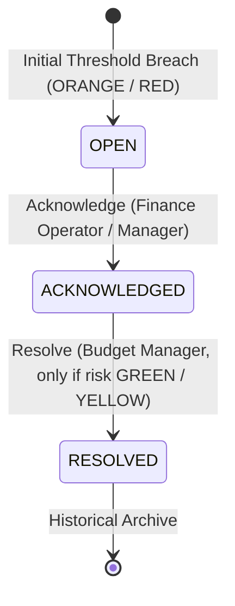

# P6-05A: Finance Alert Center Frontend

**Status:** IMPLEMENTED / MANUAL ACCEPTANCE PENDING  
**Migration Baseline:** `20260822152000_p6_05r1_finance_alert_runtime_security_closure.sql`  
**Package:** Package 6 (Finance Frontend & Alert Center)

---

## 1. Overview & Objectives

P6-05A delivers the production **Finance Alert Center** frontend at `/workspace/:workspaceId/finance/alerts`. It provides persistent, realtime-synchronized visibility and operational governance for budget risk breaches across workspace projects, phases, and task lists.

The interface serves as the central command hub for financial risk incidents, supporting:
1. **Persistent Incident Tracking:** Realtime visualization of active (OPEN, ACKNOWLEDGED) and historical (RESOLVED) budget threshold breaches.
2. **Operational Awareness Acknowledgment:** Allows authorized finance operators and managers to record operational awareness without altering financial facts.
3. **Controlled Incident Resolution:** Enables Budget Managers (`canManageBudgets`) to resolve incidents only after underlying financial risk recovers to GREEN or YELLOW.
4. **Deep-Linking & Notification Convergence:** Direct navigation from high-priority executive alerts (`?alert=<uuid>`) into live modal snapshots that update reactively.
5. **Non-Blocking Governance:** Strict adherence to Decisions 9 and 64 — alerts provide visibility and audit control without blocking operational task or workflow execution.

---

## 2. Architecture & Component Structure

```
src/
├── pages/
│   ├── FinanceAlertCenterPage.jsx       # Main Alert Center dashboard & table/card views
│   └── FinanceAlertCenterPage.module.css # 100% canonical design system tokens
├── hooks/
│   └── useFinanceAlerts.js              # Realtime data hook, RLS queries, RPC mutations
└── components/
    ├── NotificationBell.jsx             # Deep link routing to Alert Center for finance alerts
    └── finance/
        ├── FinanceAlertLifecycleBadge.jsx # OPEN, ACKNOWLEDGED, RESOLVED, CONDITION CLEARED
        ├── FinanceAlertDetailModal.jsx    # Complete incident metrics snapshot & timeline
        └── FinanceAlertResolveModal.jsx   # Controlled resolution flow with optional audit note
```

---

## 3. Access Control & Governance Matrix

| Persona / Role | Workspace Membership | Alert Center Access | Acknowledge Incident | Resolve Incident |
| :--- | :--- | :--- | :--- | :--- |
| **Workspace Owner** | Active Tenancy | Granted (`canViewWorkspaceFinance`) | Granted | Granted (when GREEN/YELLOW) |
| **Workspace Admin** | Active Tenancy | Granted (`canViewWorkspaceFinance`) | Granted | Granted (when GREEN/YELLOW) |
| **CEO / CTO** | Active Tenancy | Granted (`canViewWorkspaceFinance`) | Granted | Granted (when GREEN/YELLOW) |
| **Finance Operator** | Active Tenancy + FIN Dept | Granted (`canViewWorkspaceFinance`) | Granted | **Denied** (Budget Manager only) |
| **Project Admin only** | Any | **Denied** (Fails closed) | **Denied** | **Denied** |
| **System Admin only** | Any | **Denied** (Fails closed) | **Denied** | **Denied** |
| **Normal Member / Viewer** | Any | **Denied** (Fails closed) | **Denied** | **Denied** |

---

## 4. Lifecycle State Machine



### Invariants:
- **No Direct Table Mutations:** Client browser never issues direct `UPDATE` or `DELETE` on `public.finance_alerts`.
- **RPC Delegation:** Mutations invoke `public.acknowledge_finance_alert` and `public.resolve_finance_alert`.
- **Double Submission Guard:** Per-alert pending mutation tracking prevents concurrent race conditions.
- **Immediate State Merge + Realtime Convergence:** Optimistic RPC return merges immediately while Postgres Changes guarantees cross-client synchronization.

---

## 5. Verification & Regression Suite

All 21 dedicated P6-05A assertions and all full regression test suites passed:
- `node scripts/test-p6-05a-finance-alert-center.mjs` (21 assertions, 100% pass)
- `node scripts/test-p6-05-finance-alert-runtime.mjs` (40 assertions, 100% pass)
- `node scripts/test-p6-04c-saved-views.mjs` (50 assertions, 100% pass)
- `node scripts/test-p6-04-financial-explorer.mjs` (60 assertions, 100% pass)
- `node scripts/test-p6-03-expense-ledger.mjs` (42 assertions, 100% pass)
- `node scripts/test-p6-02-budget-management.mjs` (46 assertions, 100% pass)
- `node scripts/test-p6-01-finance-overview.mjs` (34 assertions, 100% pass)
- `npm run test:ov1-access` (50 assertions, 100% pass)
- `node scripts/verify-doc-links.mjs` (300 links checked, 0 errors)
- `npx oxlint src/` (0 errors)
- `npm run build` (Clean production build)
