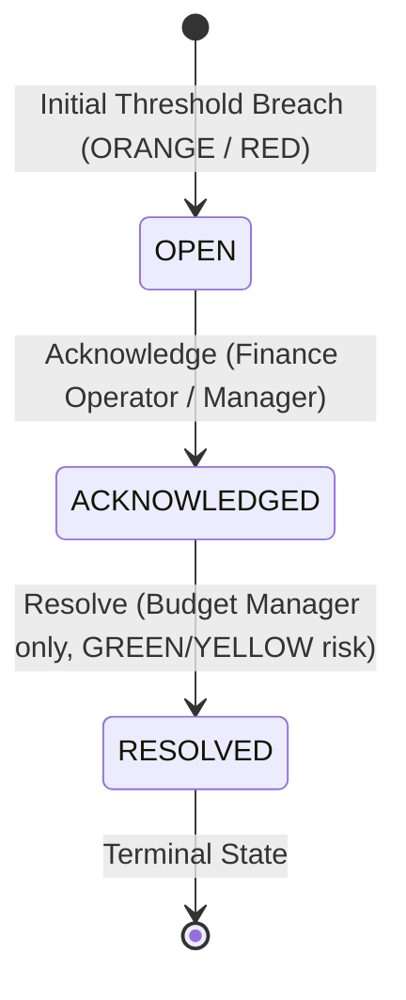

# P6-05A: Finance Alert Center Frontend & Runtime Closure

**Status:** IMPLEMENTED / MANUAL ACCEPTANCE PENDING  
**Migration Baseline:** `20260822152000_p6_05r1_finance_alert_runtime_security_closure.sql`  
**Package:** Package 6 (Finance Frontend & Alert Center)

---

## 1. Overview & Objectives

P6-05A, P6-05A1, P6-05A2, P6-05A3, P6-05A4, and P6-05A5 deliver the production **Finance Alert Center** frontend at `/workspace/:workspaceId/finance/alerts`. It provides persistent, realtime-synchronized visibility and operational governance for budget risk breaches across workspace projects, phases, and task lists.

The interface serves as the central command hub for financial risk incidents, supporting:
1. **Persistent Incident Tracking:** Realtime visualization of active (OPEN, ACKNOWLEDGED) and historical (RESOLVED) budget threshold breaches.
2. **Operational Awareness Acknowledgment:** Allows authorized finance operators and managers to record operational awareness without altering financial facts.
3. **Controlled Incident Resolution:** Enables Budget Managers (`canManageBudgets`) to resolve incidents only after underlying financial risk recovers to GREEN or YELLOW.
4. **Deep-Linking & Notification Convergence:** Direct navigation from high-priority executive alerts (`?alert=<uuid>`) into live modal snapshots that update reactively.
5. **Non-Blocking Governance:** Strict adherence to Decisions 9 and 64 — alerts provide visibility and audit control without blocking operational task or workflow execution.
6. **Atomic Mutation Mutex & Scope Isolation (P6-05A2 / P6-05A3):** Synchronous ref mutex (`pendingAlertActionsRef`) with unique lock-token ownership eliminates double-submit race conditions per alert before React rerenders, and in-flight scope token validation (`activeScopeRef`) discards stale responses upon workspace navigation.
7. **Render-Time Scope Invariant & Token Parity (P6-05A3):** Render-time current-scope invariant prevents old workspace alert exposure before `useEffect` executes, and 100% canonical CSS design tokens (`--accent`, `--line-light`) eliminate undefined variable fallbacks.
8. **Disabled / Authorization Loading Contract Closure (P6-05A4):** Hook loading evaluates `hasQueryPrerequisites` ensuring disabled hooks (`enabled=false`) report `loading=false`, `alerts=[]`, and `pendingAlertActions={}`; page separates authorization resolving (`financeAccessLoading`), access denial (`!canViewWorkspaceFinance`), and query loading (`loading && alerts.length === 0`), eliminating false perpetual skeletons for unauthorized members.
9. **Resolve Modal Authoritative-Close Closure (P6-05A5):** Removed unconditional `onClose()` inside `FinanceAlertResolveModal.handleSubmit`, making `FinanceAlertCenterPage` the sole authority for post-mutation success closure. This ensures lock collisions (`already_pending`) and stale scope returns (`staleScope: true`) keep the modal open and suppress false success feedback.

---

## 2. Architecture & Component Structure

```
src/
├── pages/
│   ├── FinanceAlertCenterPage.jsx       # Main Alert Center dashboard & table/card views
│   └── FinanceAlertCenterPage.module.css # 100% canonical design system tokens
├── hooks/
│   └── useFinanceAlerts.js              # Realtime data hook, atomic locks, RLS queries, RPC mutations
└── components/
    ├── NotificationBell.jsx             # Deep link routing to Alert Center for finance alerts
    └── finance/
        ├── FinanceAlertLifecycleBadge.jsx # OPEN, ACKNOWLEDGED, RESOLVED, CONDITION CLEARED
        ├── FinanceAlertDetailModal.jsx    # Complete incident metrics snapshot & timeline
        └── FinanceAlertResolveModal.jsx   # Controlled resolution flow with defense-in-depth
```

---

## 3. Access Control & Governance Matrix

| Persona / Role | Workspace Membership | Alert Center Access | Acknowledge Incident | Resolve Incident |
| :--- | :--- | :--- | :--- | :--- |
| **Workspace Owner** | Active Tenancy | Granted (`canViewWorkspaceFinance`) | Granted | Granted (when GREEN/YELLOW) |
| **Workspace Admin** | Active Tenancy | Granted (`canViewWorkspaceFinance`) | Granted | Granted (when GREEN/YELLOW) |
| **CEO / CTO** | Active Tenancy | Granted (`canViewWorkspaceFinance`) | Granted | Granted (when GREEN/YELLOW) |
| **Finance Operator** | Active Tenancy + FIN Dept | Granted (`canViewWorkspaceFinance`) | Granted | **Denied** (Budget Manager only) |
| **Project Admin only** | Any | **Denied** (Fails closed) | **Denied** | **Denied** |
| **System Admin only** | Any | **Denied** (Fails closed) | **Denied** | **Denied** |
| **Normal Member / Viewer** | Any | **Denied** (Fails closed) | **Denied** | **Denied** |

---

## 4. Lifecycle State Machine & Runtime Guarantees



### Runtime Invariants & Resilience Guarantees
- **Atomic Per-Alert Mutation Locks (P6-05A2):** `pendingAlertActionsRef` provides an authoritative synchronous runtime mutex preventing double-submit races before React rerenders, while maintaining per-alert concurrency (Alert A pending does not block Alert B).
- **In-Flight Scope Isolation (P6-05A2):** `activeScopeRef` captures the active workspace/user scope key when mutations begin; if scope shifts while the RPC is in flight, the returned snapshot is safely discarded from the new scope's state.
- **Authoritative Server Timestamps:** RPC return values merge authoritative backend timestamps (`acknowledged_at`, `resolved_at`) without client-side fabrication (`new Date().toISOString()`).
- **Live Resolve State Tracking by ID:** `resolveTargetAlertId` dynamically derives current alert state from the live `alerts` array, updating immediately upon Realtime changes and auto-closing if the alert becomes inaccessible.
- **Resolve Modal Defense-in-Depth:** In-modal validation guards `canResolveCurrent` against active risk re-breaches (ORANGE/RED) or unacknowledged transitions.
- **Zero-Alert Deep Link Closure:** Invalid `?alert=<uuid>` parameters are safely stripped with user feedback after initial fetch completes, regardless of whether 0 or multiple alerts exist.
- **Refresh Failure Visibility:** Background refresh errors display visible retry feedback without destroying already rendered alert rows.

---

## 5. Verification & Regression Suite

All 58 dedicated P6-05A, P6-05A1, P6-05A2, P6-05A3, P6-05A4 & P6-05A5 assertions and all full regression test suites passed:
- `node scripts/test-p6-05a-finance-alert-center.mjs` (58 assertions, 100% pass)
- `node scripts/test-p6-05-finance-alert-runtime.mjs` (40 assertions, 100% pass)
- `node scripts/test-p6-04c-saved-views.mjs` (50 assertions, 100% pass)
- `node scripts/test-p6-04-financial-explorer.mjs` (60 assertions, 100% pass)
- `node scripts/test-p6-03-expense-ledger.mjs` (42 assertions, 100% pass)
- `node scripts/test-p6-02-budget-management.mjs` (46 assertions, 100% pass)
- `node scripts/test-p6-01-finance-overview.mjs` (34 assertions, 100% pass)
- `node scripts/test-p5-01-expense-execution.mjs` (39 assertions, 100% pass)
- `node scripts/test-p5-02-expense-frontend.mjs` (77 assertions, 100% pass)
- `node scripts/test-p5-03-subtask-completion.mjs` (37 assertions, 100% pass)
- `node scripts/test-p4-01-finance-foundation.mjs` (74 assertions, 100% pass)
- `npm run test:ov1-access` (50 assertions, 100% pass)
- `node scripts/verify-doc-links.mjs` (302 links checked, 0 errors)
- `npx oxlint src/` (0 errors)
- `npm run build` (Clean production build)

---

## 6. Manual Acceptance Checklist

1. Sign in as **Workspace Owner** and verify the **Alert Center** action button appears in the **Finance Overview** header.
2. Navigate to `/workspace/:workspaceId/finance/alerts` and verify the operational governance banner displays at the top.
3. Verify the KPI summary strip displays: **5 Active Incidents**, **4 RED Breaches**, **1 ORANGE Breach**, **0 Recovered**, **0 Resolved**.
4. Verify the desktop table renders the 5 production baseline alerts (1 ORANGE Kerala Pilot, 4 RED) with `OPEN` lifecycle badges.
5. Test search filter: type `"Kerala"` $\to$ matches Kerala Pilot incident; clear search.
6. Test risk filter: select `Risk: RED` $\to$ lists the 4 RED breaches; select `All Bands` to reset.
7. Test the **Lifecycle** dropdown filter (`Active`, `Open Only`, `Acknowledged Only`, `Resolved Only`, `All Incidents`).
8. Test the **Entity Type** dropdown filter (`Project`, `Phase`, `Task List`, `All`).
9. Test the **Condition** dropdown filter (`Active Breach`, `Cleared`, `All`) and verify **Reset Filters** restores defaults.
10. Click an alert row to open `FinanceAlertDetailModal`; verify spend, base budget, buffer, overrun, utilization, and breach timestamps are rendered without raw UUIDs.
11. Click **Acknowledge Incident** in detail modal or table row; verify lifecycle updates to `ACKNOWLEDGED` and success toast appears.
12. Verify **Resolve** action is disabled with an explanatory notice while the alert risk is still active (ORANGE/RED).
13. Sign in as **Finance Operator**; verify operator can view alerts and acknowledge, but has no **Resolve** authority.
14. Sign in as **Member** or **Viewer**; verify `/workspace/:workspaceId/finance/alerts` fails closed to an Access Restricted screen.
15. Navigate to `/workspace/:workspaceId/finance/alerts?alert=<alert-uuid>`; verify matching detail modal auto-opens on load.
16. Close the detail modal; verify the `?alert` query parameter is cleanly removed from the URL without page reload.
17. Navigate to `?alert=invalid-uuid-12345`; verify an error toast appears and the invalid query param is removed safely without crashing.
18. Switch viewport to $\le 768\text{px}$ (mobile); verify table adapts into responsive cards with full badge and modal functionality.
