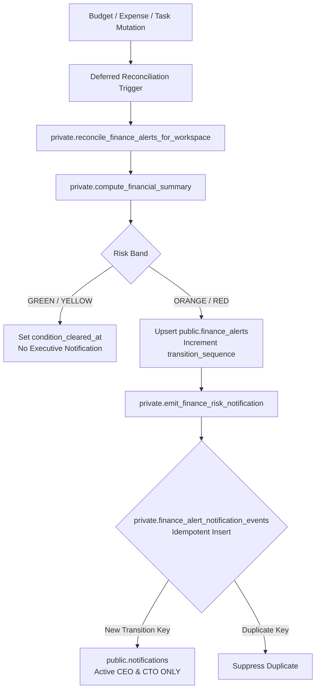

# P6-05 / P6-05R1 — Finance Alert Runtime & Persistent Alert Backend

**Package**: Package 6 — Finance Frontend  
**Status**: `VERIFIED / FROZEN` (P6-05, P6-05R1)  
**Next Sub-Package**: `P6-05A` Alert Center Frontend (`NOT STARTED / NEXT`)  
**Package 6 Overall Status**: `IN PROGRESS`  
**Database Migration Tip**: `20260822152000_p6_05r1_finance_alert_runtime_security_closure`  
**Application Baseline**: `7b317a9e45c8a965218ec624b32ea58cc988a889`  
**Security Advisor Baseline**: Exactly 6 accepted warnings (5 Process SECURITY DEFINER + 1 leaked password protection)  
**Public SECURITY DEFINER Count**: Exactly 7 functions (0 new added by P6-05 / P6-05R1)  
**Authoritative Backend Contracts**:
- `public.finance_alerts` (canonical persistent incident table with RLS, `transition_sequence` tracking & partial unique index `uq_finance_alerts_unresolved`)
- `private.finance_alert_risk_state` (canonical internal tracked risk state cache, strictly zero browser access)
- `private.finance_alert_notification_events` (canonical deterministic transition event ledger, strictly zero browser access)
- `private.reconcile_finance_alerts_for_workspace` (canonical private SECURITY DEFINER reconciliation engine, EXECUTE revoked from authenticated/anon/PUBLIC)
- `private.emit_finance_risk_notification` (canonical private SECURITY DEFINER finance notification emitter, EXECUTE revoked from authenticated/anon/PUBLIC)
- `public.acknowledge_finance_alert(p_alert_id uuid)` (SECURITY INVOKER RPC, `search_path = ''`)
- `public.resolve_finance_alert(p_alert_id uuid, p_resolution_note text)` (SECURITY INVOKER RPC, `search_path = ''`)
- Realtime publication: `public.finance_alerts` in `supabase_realtime`
- Notification types: `finance_risk_orange` and `finance_risk_red` in `notifications_type_check`

---

## 1. Executive Summary & Certified Status

P6-05 and P6-05R1 establish and certify the authoritative **Finance Alert Runtime & Persistent Alert Backend** for Stack n Stock Projects. The alert engine monitors budget consumption and risk band thresholds across Project, Phase, and Task List entities using the canonical calculation engine `private.compute_financial_summary`.



### Certified Status:
- **P6-05**: `VERIFIED / FROZEN`
- **P6-05R1**: `VERIFIED / FROZEN`
- **P6-05A Alert Center Frontend**: `NOT STARTED / NEXT`
- **Package 6**: `IN PROGRESS`

---

## 2. Certified Alert Backend & Incident Model

1. **Persistent Incident Ledger**: `public.finance_alerts` permanently stores financial alert incidents with server-governed risk snapshots, lifecycle timestamps, and actor auditing.
2. **Canonical Incident Model (Decision 54)**: At most **ONE** active unresolved alert incident exists per `(workspace_id, entity_type, entity_id)` enforced via partial unique index:
   ```sql
   CREATE UNIQUE INDEX uq_finance_alerts_unresolved
     ON public.finance_alerts (workspace_id, entity_type, entity_id)
     WHERE (lifecycle_status <> 'resolved');
   ```
3. **Lifecycle Pipeline (Decision 66)**:
   $$\text{open} \longrightarrow \text{acknowledged} \longrightarrow \text{resolved}$$
   - Direct transition from `open` to `resolved` is strictly **rejected** (`must be acknowledged first`).
   - `resolved` status is terminal and immutable. Resolved incidents remain permanently in the historical record.
   - Future breaches on an entity with a previously resolved incident create a brand-new alert incident without overwriting historical records.

---

## 3. Risk Contract & Threshold Semantics

Risk calculation is strictly inherited from the canonical Finance calculation engine (`private.compute_financial_summary` and `calculate_financial_risk_band`). There is no separate alert risk formula.

| Risk Band | Calculation Boundary | Persistent Alert Created? | Executive Notification Emitted? |
| :--- | :--- | :---: | :---: |
| **GREEN** | Actual Spend $< 80\%$ Base Budget | ❌ No | ❌ No |
| **YELLOW** | $80\% \le$ Actual Spend $\le 100\%$ Base Budget | ❌ No | ❌ No |
| **ORANGE** | Actual Spend $> 100\%$ Base Budget AND $\le \text{Base} + \text{Buffer}$ (when Buffer $> 0$) | ✅ **Yes** | ✅ **Yes** (to active CEO & CTO) |
| **RED** | Actual Spend $> \text{Base} + \text{Buffer}$, or $> \text{Base}$ when Buffer is ₹0.00 | ✅ **Yes** | ✅ **Yes** (to active CEO & CTO) |

- **YELLOW Transitions**: Moving from GREEN into YELLOW or staying within YELLOW **never** creates an alert incident and **never** notifies executives.
- **Genuine High-Risk Entries**: Automated notifications occur strictly upon genuine entry or upward escalation into **ORANGE** or **RED**.

---

## 4. Executive Notification Governance (Decision 54)

Executive threshold notifications are routed strictly and exclusively to authorized executive leadership:

1. **Eligible Recipients**:
   - Active **CEO** with active workspace tenancy (`workspace_members.status = 'active'`)
   - Active **CTO** with active workspace tenancy (`workspace_members.status = 'active'`)
2. **Excluded Personas**: Non-executive personas do **NOT** receive automated high-risk threshold notifications, including:
   - Finance Operator
   - Workspace Owner / Workspace Admin (unless also holding active CEO/CTO role)
   - Project Admin / System Admin
   - Member / Viewer
3. **Bell Notification Contract**:
   - Notification records are inserted into `public.notifications` with:
     - `type`: `finance_risk_orange` or `finance_risk_red`
     - `entity_type`: `'finance_alert'`
     - `entity_id`: `finance_alerts.id`
     - `project_id`: referenced project UUID (or NULL for standalone entities)
     - `task_id`: `NULL`

---

## 5. Transition Idempotency & Re-Breach Architecture (P6-05R1)

P6-05R1 replaced generic 10-second notification deduplication reliance with persistent, deterministic Finance transition identities:

1. **Transition Sequence Tracking**: `finance_alerts.transition_sequence` increments monotonically upon each genuine upward threshold entry (`GREEN/YELLOW -> ORANGE`, `ORANGE -> RED`, and `recovered -> ORANGE/RED`).
2. **Transition Event Ledger**: `private.finance_alert_notification_events` tracks emitted notifications with a strict unique constraint on `(alert_id, recipient_user_id, transition_key)` where:
   $$\text{transition\_key} = \langle\text{alert\_id}\rangle : \langle\text{risk\_band}\rangle : \text{seq\_}\langle\text{transition\_sequence}\rangle$$
3. **Same-Band Invariance**: Repeated deferred trigger reconciliations in the same risk band without recovery preserve `transition_sequence` and generate **zero duplicate notifications**.
4. **Rapid Re-Breach Guarantee**: Rapid genuine cycles ($\text{high} \to \text{recovery} \to \text{high}$) emit a fresh notification to each active executive even if:
   - The prior matching notification remains **unread** in the user's bell tray.
   - The re-breach occurred **less than 10 seconds** after the previous transition.

---

## 6. Independent Rapid Re-Breach Proof

During verification, an independent production rollback test executed two immediate $\text{recovery} \to \text{ORANGE}$ re-entry cycles without marking prior notifications read:

```
[EVIDENCE] Rapid Re-Breach Rollback Verification:
  - Genuine ORANGE re-entry events: 2
  - Active executive recipients: 2 (CEO, CTO)
  - Resulting notification rows: 4 (2 events × 2 recipients)
  - finance_alerts.transition_sequence: 3
  - private.finance_alert_notification_events rows: 4
  - Transaction successfully rolled back; production facts untouched.
```

---

## 7. Production Bootstrap State

Production database verification post-deployment:

| Metric | Production Count | Verification Note |
| :--- | :---: | :--- |
| **Total Finance Alerts** | **5** | Kerala Pilot (ORANGE), Site Prep (RED), Installation (RED), Property (RED), Deployment (RED) |
| **Open Incidents** | **5** | All 5 bootstrap alerts initialized in `open` state |
| **Acknowledged Incidents** | **0** | Awaiting operational acknowledgment |
| **Resolved Incidents** | **0** | Historical resolution baseline |
| **Retroactive Notifications** | **0** | Pre-existing breaches intentionally generated 0 retroactive notifications |
| **Notification Events Ledger** | **0** | Zero retroactive event rows |
| **Internal Risk State Rows** | **5** | Active tracked baseline for live change detection |

---

## 8. Condition Recovery & Lifecycle Invariants

1. **Recovery Semantics**: When canonical risk drops back to GREEN or YELLOW on an open/acknowledged incident, the incident is **NOT** automatically resolved. Instead:
   - `condition_cleared_at` is set to `clock_timestamp()`.
   - `lifecycle_status` remains `open` or `acknowledged`.
2. **Re-Breach on Unresolved Incident**: If risk subsequently escalates back to ORANGE or RED:
   - `condition_cleared_at` is cleared to `NULL`.
   - `last_breached_at` is refreshed to `clock_timestamp()`.
   - `transition_sequence` is incremented.
   - Fresh executive notifications are dispatched.

---

## 9. Lifecycle Authority Matrix (Decisions 56 & 66)

| Persona / Authority | Acknowledge Alert (`open` $\to$ `acknowledged`) | Resolve Alert (`acknowledged` $\to$ `resolved`) | Direct `open` $\to$ `resolved` |
| :--- | :---: | :---: | :---: |
| **Workspace Owner (Active)** | ✅ Allowed | ✅ Allowed (if risk is GREEN/YELLOW) | ❌ Rejected |
| **Workspace Admin (Active)** | ✅ Allowed | ✅ Allowed (if risk is GREEN/YELLOW) | ❌ Rejected |
| **CEO (Active Tenancy)** | ✅ Allowed | ✅ Allowed (if risk is GREEN/YELLOW) | ❌ Rejected |
| **CTO (Active Tenancy)** | ✅ Allowed | ✅ Allowed (if risk is GREEN/YELLOW) | ❌ Rejected |
| **Finance Operator (Active Tenancy)** | ✅ Allowed | ❌ **Denied** (Decision 56 / 66) | ❌ Rejected |
| **Member / Viewer / Unassigned** | ❌ Denied | ❌ Denied | ❌ Rejected |

- **Resolution Guard**: `public.resolve_finance_alert` strictly rejects resolution attempts while the underlying canonical risk remains **ORANGE** or **RED**. The condition must first drop to GREEN or YELLOW.
- **Terminal State**: `resolved` status is immutable. Resolved rows cannot be re-opened or deleted by client roles.

---

## 10. Security Architecture & Privilege Matrix

### 10.1 Public Lifecycle RPCs
- `public.acknowledge_finance_alert(p_alert_id uuid)`
- `public.resolve_finance_alert(p_alert_id uuid, p_resolution_note text)`
- **Security Properties**:
  - `SECURITY INVOKER`
  - `SET search_path = ''`
  - `authenticated` role: `EXECUTE = true`
  - `anon` role: `EXECUTE = false`
  - `PUBLIC` pseudo-role: `EXECUTE = false`

### 10.2 Private Engine & Trigger Functions (P6-05R1 Hardened)
All private trigger and reconciliation functions execute with internal `SECURITY DEFINER` and empty `search_path`. Direct execution from client and browser roles is strictly revoked:

| Function Name | `authenticated` | `anon` | `PUBLIC` | `service_role` | `postgres` |
| :--- | :---: | :---: | :---: | :---: | :---: |
| `private.reconcile_finance_alerts_for_workspace` | ❌ `false` | ❌ `false` | ❌ `false` | ✅ `true` | ✅ `true` |
| `private.emit_finance_risk_notification` | ❌ `false` | ❌ `false` | ❌ `false` | ✅ `true` | ✅ `true` |
| `private.trg_fn_finance_alerts_guard_mutation` | ❌ `false` | ❌ `false` | ❌ `false` | ✅ `true` | ✅ `true` |
| `private.trg_fn_finance_alerts_reconcile_budgets` | ❌ `false` | ❌ `false` | ❌ `false` | ✅ `true` | ✅ `true` |
| `private.trg_fn_finance_alerts_reconcile_expense_transactions` | ❌ `false` | ❌ `false` | ❌ `false` | ✅ `true` | ✅ `true` |
| `private.trg_fn_finance_alerts_reconcile_expense_items` | ❌ `false` | ❌ `false` | ❌ `false` | ✅ `true` | ✅ `true` |
| `private.trg_fn_finance_alerts_reconcile_tasks` | ❌ `false` | ❌ `false` | ❌ `false` | ✅ `true` | ✅ `true` |

---

## 11. Row Level Security & Operational Isolation

1. **`public.finance_alerts` RLS**:
   - `SELECT`: Allowed for active Workspace Owner, Admin, CEO, CTO, and Finance Operator. Denied for Member, Viewer, Project Admin alone, System Admin alone.
   - `INSERT / DELETE`: Denied for all authenticated clients (system trigger and RPC managed only).
   - `UPDATE`: Restricted via mutation guard trigger `private.trg_fn_finance_alerts_guard_mutation` (only lifecycle transitions via approved RPCs are permitted).
2. **Operational RLS Isolation**: Operational table RLS policies were **NOT** modified or broadened. Operational SELECT visibility remains strictly scoped by involvement:
   - `projects_select_member` $\to$ `private.can_view_operational_project(id)`
   - `phases_select_member` $\to$ `private.can_view_operational_phase(id)`
   - `task_lists_select_member` $\to$ `private.can_view_operational_task_list(id)`
   - `tasks_select_member` $\to$ `private.can_view_operational_task(id)`
3. **Finance Metadata Separation**: Finance hierarchy discovery remains handled via dedicated RPCs (`get_workspace_finance_explorer_metadata`), preserving complete operational containment.

---

## 12. Transaction Safety & Non-Blocking Invariant

1. **Deferred Trigger Execution**: Alert reconciliation triggers are declared `DEFERRABLE INITIALLY DEFERRED`, evaluating risk snapshots atomically at `COMMIT` time.
2. **Informational & Non-Blocking**: The Finance Alert Runtime is strictly informational. Budget overruns or alert creations **NEVER** block:
   - Task completion
   - Subtask completion
   - Defined Process step execution or phase progression
   - Project closure
3. **Zero Approval Gates**: No operational workflow requires financial sign-off to proceed.

---

## 13. Automated Verification & Regression Gate

The verification suite `scripts/test-p6-05-finance-alert-runtime.mjs` executes **40 automated integration assertions** across 3 comprehensive test suites:

```
═══════════════════════════════════════════════════════════════════════════
  SNS PROJECTS — P6-05 & P6-05R1 FINANCE ALERT RUNTIME VERIFICATION SUITE   
═══════════════════════════════════════════════════════════════════════════

--- Suite 1: Production Deployment & Bootstrap State ---
[PASS 1] Migrations 20260822144843 & 20260822152000 are recorded in schema_migrations
[PASS 2] Security Advisor baseline intact: exactly 7 public SECURITY DEFINER functions (0 new added by P6-05/R1)
[PASS 3] public.acknowledge_finance_alert & resolve_finance_alert are SECURITY INVOKER with search_path=""
[PASS 4] All private alert engine, trigger, and notification functions are private SECURITY DEFINER with search_path=""
[PASS 5] Private function execution strictly REVOKED from authenticated, anon, and PUBLIC roles (P6-05R1)
[PASS 6] public.finance_alerts is registered in supabase_realtime publication
[PASS 7] notifications_type_check correctly includes finance_risk_orange and finance_risk_red alongside all 20 existing types
[PASS 8] Table privileges on public.finance_alerts strictly enforce least privilege (anon all false, auth SELECT/restricted UPDATE only)
[PASS 9] Production bootstrap: exactly 5 open Finance Alerts created (1 ORANGE: Kerala Pilot, 4 RED: Site, Installation, Property, Deployment)
[PASS 10] Production bootstrap: exactly 0 retroactive finance_risk_orange / finance_risk_red notifications generated

--- Suite 2: Isolated Integration Fixtures & Risk Transitions ---
[PASS 11] GREEN risk state on fresh budget generates zero alert rows
[PASS 12] GREEN -> YELLOW transition (Spend = ₹8,500) generates 0 alerts and 0 notifications
[PASS 13] YELLOW -> ORANGE threshold entry creates exactly one OPEN incident with accurate financial snapshot
[PASS 14] ORANGE notification routed exclusively to active CEO and CTO; non-executive roles excluded
[PASS 15] ORANGE same-band spend update refreshes existing incident metrics without duplicate alerts or notifications
[PASS 16] ORANGE -> RED escalation updates existing incident, sets red_at, and sends finance_risk_red notification
[PASS 17] Repeated RED reconciliation generates zero duplicate RED notifications
[PASS 18] RED -> ORANGE downward shift updates current_risk_band without sending new notifications
[PASS 19] Risk drop to YELLOW sets condition_cleared_at while preserving open lifecycle status (no auto-resolve)
[PASS 20] Recover -> ORANGE immediately while previous notification remains UNREAD emits exactly one NEW notification per executive
[PASS 21] Rapid recover -> ORANGE -> recover -> ORANGE in <10s emits two distinct transition notifications per executive
[PASS 22] Re-breach RED after recovery emits new RED notification even if previous notification is unread

--- Suite 3: Lifecycle Mutation & Permissions Matrix ---
[PASS 23] Unauthorized roles (Member, Viewer, ProjAdmin alone, SysAdmin alone, Other Workspace) strictly fail closed on SELECT
[PASS 24] Authorized personas (Owner, Admin, CEO, CTO, Finance Operator) can SELECT workspace alerts
[PASS 25] Finance Operator can acknowledge open alert (OPEN -> ACKNOWLEDGED) with server-owned actor and timestamp
[PASS 26] Finance Operator is strictly DENIED resolution authority (Decision 56 / 66 enforced)
[PASS 27] Resolution is strictly REJECTED while underlying canonical risk remains ORANGE / RED
[PASS 28] Spend reduced to ₹0.00 (GREEN); condition_cleared_at recorded
[PASS 29] Budget Manager successfully resolves alert once condition is GREEN (ACKNOWLEDGED -> RESOLVED)
[PASS 30] RESOLVED lifecycle status is terminal and immutable
[PASS 31] Future breach after incident resolution creates a fresh new alert while permanently preserving historical resolved incident
[PASS 32] Itemized multi-line expense insertion reconciles atomically at transaction commit with zero intermediate duplicate alerts
[PASS 33] Budget modification trigger re-evaluates canonical risk and sets condition_cleared_at when risk drops
[PASS 34] Direct OPEN -> RESOLVED transition is rejected (Decision 66 Open -> Acknowledged -> Resolved enforced)
[PASS 35] Hierarchy alert derivation: Phase and Task List budget breaches generate dedicated persistent alerts
[PASS 36] Task hierarchy movement dynamically re-attributes spend and evaluates alerts for both source and destination entities
[PASS 37] private.finance_alert_risk_state & private.finance_alert_notification_events are strictly internal
[PASS 38] Direct client INSERT, DELETE, and arbitrary snapshot UPDATE on public.finance_alerts are strictly blocked
[PASS 39] Authenticated client cannot gain engine write privileges or bypass mutation security
[PASS 40] Clean PostgreSQL transaction rollback completed — test fixtures left no trace

═══════════════════════════════════════════════════════════════════════════
  ALL 40 P6-05 / P6-05R1 FINANCE ALERT RUNTIME ASSERTIONS PASSED!
═══════════════════════════════════════════════════════════════════════════
```

### Full Regression Suite Status:
- `test-p6-05-finance-alert-runtime.mjs`: **40/40 PASSED**
- `test-p6-04c-saved-views.mjs`: **50/50 PASSED**
- `test-p6-04-financial-explorer.mjs`: **60/60 PASSED**
- `test-p6-03-expense-ledger.mjs`: **42/42 PASSED**
- `test-p6-02-budget-management.mjs`: **46/46 PASSED**
- `test-p6-01-finance-overview.mjs`: **34/34 PASSED**
- `test-p5-01-expense-execution.mjs`: **39/39 PASSED**
- `test-p5-03-subtask-completion.mjs`: **37/37 PASSED**
- `test-p4-01-finance-foundation.mjs`: **74/74 PASSED**
- `npm run test:ov1-access`: **51/51 PASSED** (30 auth + 20 ownership + 1 frontend contract)
- `node scripts/verify-doc-links.mjs`: **300/300 links valid (0 errors)**
- `npx oxlint src/`: **0 errors**
- `npm run build`: **Production build succeeded**

---

## 14. Security Advisor & Performance Baseline

1. **Security Advisor Warnings**: Exactly **6 accepted warnings**:
   - 5 existing authenticated public Process `SECURITY DEFINER` functions
   - 1 leaked password protection notice
2. **Public `SECURITY DEFINER` Count**: Exactly **7 functions** (0 new functions added by P6-05 or P6-05R1).
3. **Performance Advisor**: Informational unindexed foreign-key notices on pre-existing schema are noted. No schema or indexing changes were introduced during this certification task.

---

## 15. Operational V1 Test Fixture Governance

In `scripts/test-ov1-a-operational-visibility.mjs`, insertion of a `Done` (`system_code = 'done'`) task status was added for test projects alongside `To Do`. This was required for fixture compatibility with canonical subtask closure triggers (`private.resolve_project_done_status(uuid)` called by `private.trg_fn_subtask_parent_sync()`) deployed in Package 5, without modifying any operational RLS policies.
