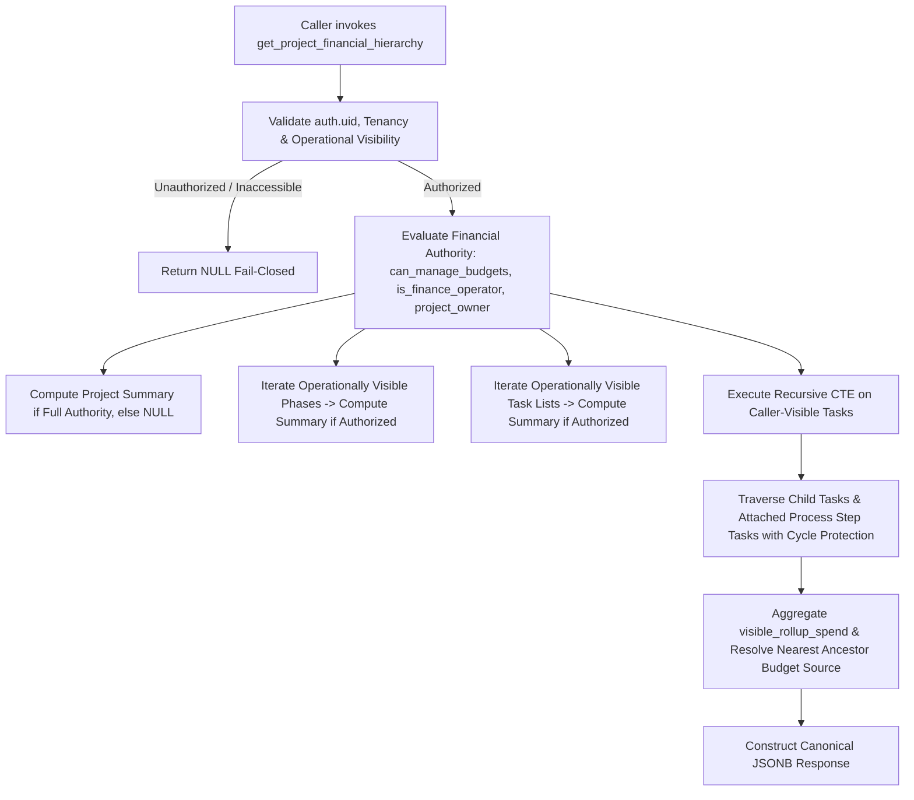

# P7-01: Financial Hierarchy Read Model & Security Contract

**Package**: Package 7 — Financial Hierarchy UX  
**Slice**: P7-01 (Backend Read Model, Database Security Contract, Frontend Data Hook & Normalization)  
**Status**: `VERIFIED / FROZEN`  
**Migration**: `20260823180000_p7_01_financial_hierarchy_read_model.sql`  
**Automated Verification**: `scripts/test-p7-01-financial-hierarchy.mjs` (41/41 assertions passed)

---

## 1. Overview & Architectural Mission

P7-01 establishes the canonical, secure, and performant financial read model required by the Project hierarchy interface. It delivers bounded, project-scoped financial metrics and rollup aggregations without requiring wide table-level permissions or broad operational visibility.

### Key Architectural Invariants
1. **Container Budget Ownership Invariant**: Budgets are owned strictly and exclusively by Projects, Phases, and Task Lists. Tasks **never** own budgets and do not expose Base Budget, Safety Buffer, Remaining Budget, Utilization %, or Task-owned Risk Bands.
2. **Authoritative Backend Risk Evaluation**: All risk bands (`GREEN`, `YELLOW`, `ORANGE`, `RED`) and monetary utilization metrics remain 100% backend-calculated. Zero client-side risk band computation or threshold re-evaluation exists.
3. **Operational Visibility + Financial Authority Gate (OV1-A Authoritative)**: The RPC evaluates the intersection of operational visibility (Operational V1 / OV1-A) and financial authorization. Under OV1-A, workspace membership is a tenancy prerequisite, not a broad operational visibility grant. Workspace Owner/Admin roles alone do not produce portfolio-wide operational visibility. If the caller cannot operationally view the requested Project, the RPC strictly returns `NULL` (fail-closed).
4. **Zero UUID Leakage**: Unauthorized or operationally hidden Phases, Task Lists, and Tasks are completely omitted from the payload (never exposing hidden entity IDs).
5. **Exact-Once Leaf Rollup Aggregation**: Task `visible_rollup_spend` computes the sum of the task's own direct spend (including direct subtask expenses), visible descendant child tasks, and visible host-task-attached process step tasks. Inaccessible siblings, hidden child tasks, and standalone processes never contribute to task rollups.
6. **Zero Visual UI Mutation in P7-01**: Visual hierarchy components (`TasksPage.jsx`, `HierarchyTaskTree.jsx`) are strictly untouched in P7-01 (reserved exclusively for P7-02).

---

## 2. Database Schema & RPC Architecture

### Public API Wrapper
- **Signature**: `public.get_project_financial_hierarchy(p_project_id uuid)`
- **Security Mode**: `SECURITY INVOKER`, `STABLE`, `SET search_path = ''`
- **Grants**: Granted to `authenticated`; revoked from `PUBLIC` and `anon`. Zero new public `SECURITY DEFINER` functions added (maintaining the frozen baseline of 7 public security definer functions).

### Private Implementation Engine
- **Signature**: `private.get_project_financial_hierarchy_internal(p_project_id uuid)`
- **Security Mode**: `SECURITY DEFINER`, `STABLE`, `SET search_path = ''`
- **Access Control**: Identity bound to `auth.uid()`. Execution granted to `authenticated`; revoked from `PUBLIC` and `anon`.

### Execution Flow & CTE Pipeline

---

## 3. Financial Visibility & Authorization Matrix

| Persona | Operational Scope | Container Summaries (`project_summary`, `phase_summaries`, `task_list_summaries`) | Task Read Model (`direct_spend`, `visible_rollup_spend`) | `financial_visibility` |
| :--- | :--- | :--- | :--- | :--- |
| **Workspace Owner** | Caller's operationally visible project scope | Full container summaries across visible scope; `NULL` on uninvolved projects | Full task rollups across visible tasks | `full` (or `NULL`) |
| **Workspace Admin** | Caller's operationally visible project scope | Full container summaries across visible scope; `NULL` on uninvolved projects | Full task rollups across visible tasks | `full` (or `NULL`) |
| **Active CEO / CTO** | Portfolio-wide global visibility | Full container summaries across workspace | Full task rollups across all tasks | `full` |
| **Finance Operator** | Caller's operationally visible project scope | Full container summaries for operationally accessible projects; `NULL` on hidden | Full task rollups for operationally accessible tasks | `full` (or `NULL`) |
| **Project Owner** | Owned project | Full container summaries within owned project | Full task rollups within owned project | `full` |
| **Phase Owner** | Owned phase tasks | Scoped summary for owned Phase and child Task Lists (`project_summary: null`) | Task rollups for visible tasks | `partial` |
| **Task List Participant** | Assigned tasks | Container summaries `NULL` | Task rollups for visible tasks only | `task_only` |
| **Task Assignee / RACI** | Assigned tasks | Container summaries `NULL` | Task rollups for visible tasks only | `task_only` |
| **Project Admin (No Finance Role)** | Portfolio-wide operational | Container summaries `NULL` | Task rollups for operational tasks | `task_only` |
| **System Admin (No Finance Role)** | Portfolio-wide operational | Container summaries `NULL` | Task rollups for operational tasks | `task_only` |
| **Unauthenticated / Inactive** | None | `NULL` | `NULL` | `NULL` |

---

## 4. Frontend Hook & Normalization Model

### `src/hooks/useProjectFinancialHierarchy.js`
- **Context Integration**: Imports canonical `useAuth` from `../contexts/AuthContext.jsx`.
- **Cache Key Strategy**: `${userId}:${workspaceId}:${projectId}:${authorizationScopeKey}`
- **Render-Time Scope Invariant**: Synchronously validates `activeScopeKey === currentScopeKey` during render, ensuring zero stale data leakage on fast project/workspace transitions before `useEffect` execution.
- **Request Generation Tokens**: Uses `activeFetchIdRef` to discard out-of-order in-flight RPC responses.
- **Fail-Closed Default**: Returns `{ financialHierarchy: null, loading: false, error: null }` when disabled, missing projectId, or unauthorized.

### `src/lib/finance.js` — `normalizeProjectFinancialHierarchy`
- Formats container metrics with INR precision and preserves authoritative backend risk bands (`GREEN`, `YELLOW`, `ORANGE`, `RED`).
- Normalizes task entries (`direct_spend`, `visible_rollup_spend`, `budget_source_type`, `budget_source_id`, `financial_visibility`).

---

## 5. Verification & Security Invariants

The automated test suite `scripts/test-p7-01-financial-hierarchy.mjs` validates 41 assertions across 5 comprehensive test suites:
- **Suite 1: Schema, Grants & Security Baseline** (SECURITY INVOKER wrapper, SECURITY DEFINER private engine, search_path='', 0 new public SECURITY DEFINER functions).
- **Suite 2: Multi-Persona Fixtures & Hierarchy Setup** (12 personas, 2 workspaces, 3 projects, phases, task lists, tasks, subtasks, process instances).
- **Suite 3: Persona Access & Hierarchy Contracts** (Personas 1–12 verified).
- **Suite 4: Detailed Test Invariants (Assertions A–S)**:
  - Assertion A: Inaccessible project returns `NULL`.
  - Assertions B, C, D: Hidden Phase/Task List/Task IDs omitted (zero UUID leakage).
  - Assertion E: Hidden child task spend excluded from Member visible rollup (3500 vs 7500).
  - Assertion F: Hidden sibling tasks and spend excluded.
  - Assertion G: Process step task spend rolls up into host task.
  - Assertion H: Unrelated process step tasks do not leak into other task rollups.
  - Assertion I: Child task direct and rollup spend computed correctly.
  - Assertion J: Real cycle protection (`NOT child.id = ANY(path)`), recursion depth cutoff (< 50), and database check constraint `chk_tasks_no_self_parent` verified with live cyclic dataset.
  - Assertion K: Subtask expense counted exactly once in parent task direct spend.
  - Assertion L: Voided transactions excluded.
  - Assertion M: Corrected transactions handled canonically.
  - Assertion N: Nearest budget source resolution verified (`task_list` $\to$ `phase` $\to$ `project` $\to$ `none`).
  - Assertion O: Own-budget container semantics verified.
  - Assertion P: Project Admin & System Admin operational visibility without container finance.
  - Assertion Q: Finance Operator authority does not reveal operationally hidden projects.
  - Assertions R, S: Cross-project and cross-workspace isolation.
- **Suite 5: Real React Hook Execution & Scope Isolation (Assertions T–Z)**:
  - Assertion T: Real React hook initial authorized project fetch & normalization verified in `createRoot` + `act`.
  - Assertion U: Real React hook `enabled=false` & missing `projectId` strictly fail closed.
  - Assertion V: Real React hook workspace switch immediately isolates state (zero stale frame leak).
  - Assertion W: Real React hook project switch immediately isolates state (zero stale frame leak).
  - Assertion X: Real React hook user switch immediately isolates state (zero stale frame leak).
  - Assertion Y: Real React hook `authorizationScopeKey` switch immediately isolates state (zero stale frame leak).
  - Assertion Z: Real React hook in-flight race rejection, generation token & cache isolation verified.
