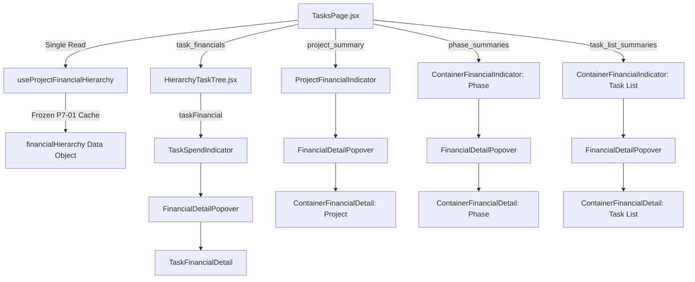

# P7-02B — Financial Detail Popovers & Context Cards

## 1. Executive Summary

| Attribute | Value |
| :--- | :--- |
| **Package** | Package 7: Financial Hierarchy UX |
| **Component** | P7-02B — Financial Detail Popovers & Context Cards |
| **Status** | **`IMPLEMENTED / FINAL ACCEPTANCE REQUIRED`** |
| **Depends On** | P7-01 (`VERIFIED / FROZEN`), P7-02A (`VERIFIED / FROZEN`) |
| **Precedes** | P7-02C (`Interactive Financial Hierarchy Explorer`) |
| **Primary Scope** | Popover detail cards for Project, Phase, Task List, and Tasks in Hierarchy View |
| **Database Migrations** | None (Zero new RPCs, zero DB schema mutations; P7-01 read model is frozen) |

P7-02B extends the compact P7-02A financial hierarchy indicators with accessible, interactive financial detail popovers and context cards. The operational hierarchy remains an execution-first interface, providing deep financial explanations only when users hover or click on the existing compact finance indicators.

---

## 2. Architecture & Design Principles



### Key Architectural Invariants:
1. **Zero New Finance RPCs & Zero Direct Table Queries**:
   - P7-02B consumes **exclusively** the normalized `financialHierarchy` dataset already loaded once per project view by `useProjectFinancialHierarchy`.
   - No direct queries against `budgets`, `expense_transactions`, `expense_items`, or `finance_alerts`.
2. **Zero Client-Side Risk Recalculation**:
   - Frontend components directly render backend `risk_band` values (`GREEN`, `YELLOW`, `ORANGE`, `RED`) through `FinanceRiskBadge`.
3. **No Persistent Local State Cloning**:
   - Popover state management is strictly confined to UI interaction (`isOpen`, `isPinned`, coordinates). Finance data is passed as pure render props.
4. **Portal Rendering & Stacking Context Safety**:
   - Popover cards render to `document.body` via `createPortal` with `position: fixed`, completely eliminating clipping from parent CSS overflows, transforms, or scrolling boundaries.
5. **Exact Scope Isolation**:
   - `scopeKey` (`${workspaceId}:${projectId}:${authorizationScopeKey}:${view}`) is passed to all popover instances. Any switch of project, workspace, user, or view tab (e.g., Hierarchy $\to$ Kanban/List) instantly dismisses open popovers.

---

## 3. Component Details & Behavior Matrix

### 3.1 `FinancialDetailPopover` (`src/components/finance/hierarchy/FinancialDetailPopover.jsx`)
- **Trigger Management**: Accessible button trigger with `aria-haspopup="dialog"`, `aria-expanded={isOpen}`, and `:focus-visible` styling.
- **Interactions**:
  - **Desktop Hover**: Opens preview with a 120ms debounce to prevent accidental flicker during fast pointer movements.
  - **Click / Tap**: Pins the popover open until explicitly closed (clicking again, pressing `Escape`, or clicking outside).
  - **Keyboard Navigation**: `Enter` and `Space` toggle open/pinned state; `Escape` closes the popover and restores keyboard focus to the trigger.
- **Positioning Engine**:
  - Dynamic positioning with viewport boundary clamping (`24px` gutter) and automatic flip detection (`bottom` vs `top`).
  - Supports mobile viewports down to 390px with full horizontal responsiveness (`max-width: calc(100vw - 24px)`).
  - Respects `@media (prefers-reduced-motion: reduce)`.

### 3.2 `ContainerFinancialDetail` (`src/components/finance/hierarchy/ContainerFinancialDetail.jsx`)
- **Project Summary**:
  - **Budget Section**: `Base Budget`, `Safety Buffer`, `Total Ceiling`.
  - **Spend Section**: `Actual Spend`, `Remaining Base`.
  - **Buffer Section**: `Buffer Used`, `Buffer Remaining` (shown when buffer > 0).
  - **Status Section**: `Utilization %`, `Overrun` (shown when overrun > 0), canonical `FinanceRiskBadge`.
- **Own-Budget Containers (Phase / Task List)**:
  - Explicit badge: `Phase Budget Owner` / `Task List Budget Owner`.
  - Full budgetary, spend, buffer, and risk breakdown.
- **Inherited-Budget Containers**:
  - Explicit badge: `Uses Project Budget` / `Uses Phase Budget`.
  - Clarification notice: `"This Phase does not own an independent budget."` / `"This Task List uses the Phase budget."`
  - Explicit context section: `CONTEXTUAL BUDGET (PROJECT)` / `CONTEXTUAL BUDGET (PHASE)`.
  - Prohibits labeling ancestor budget as the container's own budget.
- **Truly Unbudgeted Containers**:
  - Badge: `UNBUDGETED`.
  - Displays `Actual Spend` and clear notice: `"No effective budget assigned."`
  - Prohibits fake denominators, ₹0 bases, or fabricated GREEN risk.

### 3.3 `TaskFinancialDetail` (`src/components/finance/hierarchy/TaskFinancialDetail.jsx`)
- **Spend Breakdown**:
  - `Direct Spend`: Formatted in INR (`formatCurrency`).
  - `Visible Subtree Spend`: Rendered **only** when child tasks exist and `visible_rollup_spend !== direct_spend`.
  - Mandatory security help text: `"Includes spend from work visible to you."`
- **Budget Context**:
  - `Uses Task List Budget`, `Uses Phase Budget`, `Uses Project Budget`, or `No inherited budget`.
- **Strict Prohibitions Enforced**:
  - Tasks **never** display Base Budget, Safety Buffer, Total Ceiling, Remaining Base, Utilization %, or Risk Bands.

### 3.4 Subtask Boundary
- Subtasks do not render `TaskSpendIndicator` or `FinancialDetailPopover`. Their spend is aggregated exactly once into the parent Task.

---

## 4. Verification & Certification

All 54 dedicated automated test assertions in `scripts/test-p7-02b-financial-detail-popovers.mjs` passed alongside the full platform regression gate:

```bash
# Dedicated P7-02B Test Suite
npm run test:p7-02b
# Output: ALL 54 P7-02B FINANCIAL DETAIL POPOVER ASSERTIONS PASSED!

# Full Platform Regression Gate
npm run test:p7-02a             # 56 / 56 PASSED
npm run test:p7-01              # 41 / 41 PASSED
npm run test:auth-recovery      # 51 / 51 PASSED
npm run test:ov1-access         # 30 + 20 PASSED
npm run test:ov1-frontend       # 37 / 37 PASSED
npm run test:ov1-dashboard      # 43 / 43 PASSED
npm run test:loading-stabilization # 24 / 24 PASSED
npm run test:stability          # 14 routes + 16 failure states PASSED
Package 6 Test Suites (P6-01 - P6-05A) # 276 / 276 PASSED
Package 5 Test Suites (P5-01 - P5-03C) # 153 / 153 PASSED
Package 4 Test Suites (P4-01 - P4-01B) # 74 / 74 PASSED
npm run verify:css-modules      # PASSED
node scripts/verify-doc-links.mjs # PASSED
npx oxlint src/                 # 0 Errors
npm run build                   # Built successfully
```

---

## 5. Artifact & File Landscape

| File | Purpose |
| :--- | :--- |
| `src/components/finance/hierarchy/FinancialDetailPopover.jsx` | Reusable accessible popover container with portal rendering, dynamic height flip/clamping, and keyboard/focus management |
| `src/components/finance/hierarchy/FinancialDetailPopover.module.css` | Styles for trigger button, fixed floating card, vertical viewport containment (`max-height: calc(100vh - 24px)`), focus rings, and responsive viewport sizing |
| `src/components/finance/hierarchy/ContainerFinancialDetail.jsx` | Financial detail context card for Project, Phase, and Task List containers (honoring `is_budgeted=false` unbudgeted Project semantics) |
| `src/components/finance/hierarchy/ContainerFinancialDetail.module.css` | Grid styling for container budget and spend breakdowns |
| `src/components/finance/hierarchy/TaskFinancialDetail.jsx` | Financial detail context card for Tasks (direct spend, visible subtree spend, budget context) |
| `src/components/finance/hierarchy/TaskFinancialDetail.module.css` | Metric styling for task spend indicators |
| `src/components/finance/hierarchy/ProjectFinancialIndicator.jsx` | Wraps compact project indicator as popover trigger |
| `src/components/finance/hierarchy/ContainerFinancialIndicator.jsx` | Wraps compact phase and task list indicator as popover trigger |
| `src/components/finance/hierarchy/TaskSpendIndicator.jsx` | Wraps compact task spend indicator as popover trigger |
| `src/components/finance/hierarchy/index.js` | Exports all hierarchy finance components |
| `scripts/test-p7-02b-financial-detail-popovers.mjs` | 54 automated test assertions verifying interaction, accessibility, scope safety across all 3 process placements, unbudgeted Project semantics, and data presentation |
