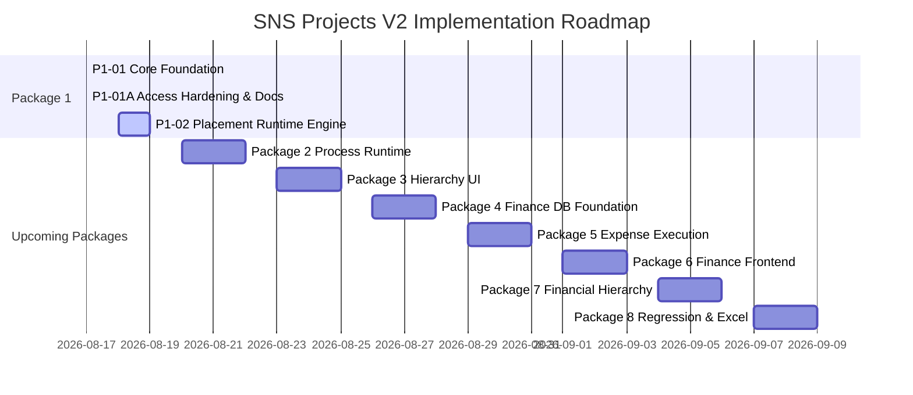

# SNS Projects — Master Documentation Index

## 1. System Overview

**StacknStock Projects (SNS Projects)** is an enterprise-grade project and process execution platform designed for industrial and multi-disciplinary teams. It unifies high-level strategic project milestones, tactical Kanban task boards, full RACI accountability matrixes, and strict sequential/DAG Defined Process Workflows into a single coherent system.

---

## 2. Current Technical Baseline

- **Frontend Application**: React 18 + Vite SPA, Vanilla CSS Modules, Lucide React icons
- **Backend Architecture**: Supabase PostgreSQL 15, Row-Level Security (RLS), Edge Functions (Deno / TypeScript)
- **Production Hosting**: GitHub Pages CDN
- **Production URL**: `https://abzops.github.io/sns-projects/`
- **Supabase Project Reference**: `gqerfixdmgbqahgslzsq`
- **Current Canonical Migration**: `20260817064609_p1_01_process_instance_access_hardening.sql`
- **Latest Implementation Commit**: `65efb78` (P1-01 Core Hierarchy Foundation) + current hardening commit

> [!IMPORTANT]
> **Zero Secrets Policy**: This repository and all associated documentation strictly prohibit committing secrets, access keys, or production passwords.

---

## 3. Documentation Map

| Category | Description | Primary Reference |
| :--- | :--- | :--- |
| **`00_Governance`** | Documentation standards, roadmaps, implementation workflow | [Documentation Standard](00_Governance/DOCUMENTATION_STANDARD.md) · [Implementation Roadmap](00_Governance/IMPLEMENTATION_ROADMAP.md) |
| **`01_Product_Architecture`** | Target architecture blueprints and system audit reports | [Architecture Blueprint](01_Product_Architecture/SNS_Projects_V2_Architecture_Blueprint.md) · [Current State Audit](01_Product_Architecture/SNS_Projects_Current_State_Audit.md) |
| **`02_Database_and_Data_Architecture`** | Database schema designs, hierarchy alignment, migration chains | [Hierarchy Alignment](02_Database_and_Data_Architecture/Day0_Release2_5_Hierarchy_Alignment.md) · [Migration History](02_Database_and_Data_Architecture/Migration_History_Reconciliation.md) |
| **`03_Security_and_Authentication`** | RLS security policies, role hierarchies, user onboarding | [Security Hardening](03_Security_and_Authentication/Day0_Release1_1_Security_Hardening.md) · [Org Admin & Auth](03_Security_and_Authentication/V1_01_Organization_Admin_and_Auth.md) |
| **`04_Defined_Processes`** | Defined Process Engine, DAG step execution, RACI contracts | [Engine Architecture Plan](04_Defined_Processes/Defined_Process_Engine_Architecture_Plan.md) · [Runtime API Contract](04_Defined_Processes/Defined_Process_Runtime_API_Contract.md) |
| **`05_Finance`** | Financial tracking, budget allocation, cost centers, expense integration | *Finance planning specifications (Upcoming Packages 4–7)* |
| **`06_Implementation_Packages`** | Technical specifications for discrete engineering delivery packages | [P1-01 Foundation](06_Implementation_Packages/Package_01_Core_Foundation/P1-01_Core_Hierarchy_Process_Instance_Foundation.md) · [P1-01A Hardening](06_Implementation_Packages/Package_01_Core_Foundation/P1-01A_Process_Instance_Access_Hardening.md) |
| **`07_Testing_and_QA`** | Verification suites, static contract validation, safety harnesses | [Testing Directory](07_Testing_and_QA/) |
| **`08_Deployment_and_Operations`** | Data seed operations, migrations deployment, backup runs | [Structured Reseed Report](08_Deployment_and_Operations/Structured_Data_Reseed_Report.md) |
| **`09_Decision_Records`** | Architecture Decision Records (ADRs) | [Architecture Decisions](09_Decision_Records/ARCHITECTURE_AND_PROCESS_DECISIONS.md) |
| **`10_Release_Notes`** | Production release notes, changelogs, and hotfix reports | [Day-0 Release Notes](10_Release_Notes/Day0_Release1_Production_MVP.md) · [Hotfix Reports](10_Release_Notes/) |
| **`99_Archive`** | Historical or superseded project documentation | [Archive Directory](99_Archive/) |

---

## 4. Current Implementation Status

- **Package 1 — Core Foundation**:
  - `P1-01`: Core Hierarchy + Process Instance Foundation — **`VERIFIED`**
  - `P1-01A`: Process Instance Access Hardening & Documentation Baseline — **`VERIFIED`**
  - `P1-02`: Placement-Aware Process Runtime Engine — **`NEXT`**
- **Package 2 — Process Runtime Refactor**: **`PLANNED`**
- **Package 3 — Hierarchy UI / UX Alignment**: **`PLANNED`**
- **Package 4 — Finance Database Foundation**: **`PLANNED`**
- **Package 5 — Expense Execution Integration**: **`PLANNED`**
- **Package 6 — Finance Frontend**: **`PLANNED`**
- **Package 7 — Financial Hierarchy**: **`PLANNED`**
- **Package 8 — Regression & Defined Process Excel Import**: **`PLANNED`**

---

## 5. Key Architecture Decisions & Known Open Items

- **[ADR-01](09_Decision_Records/ARCHITECTURE_AND_PROCESS_DECISIONS.md#adr-01-five-level-core-project-hierarchy)**: 5-Level Work Hierarchy (Workspace $\to$ Project $\to$ Phase $\to$ Task List $\to$ Task $\to$ Child Task).
- **[ADR-02](09_Decision_Records/ARCHITECTURE_AND_PROCESS_DECISIONS.md#adr-02-phase-terminology-cutover-via-dual-sync-compatibility-layer)**: Non-breaking Phase compatibility layer with bidirectional triggers and `public.phases` view.
- **[ADR-03](09_Decision_Records/ARCHITECTURE_AND_PROCESS_DECISIONS.md#adr-03-standalone-task--process-support)**: Standalone tasks & processes enabled by nullable `tasks.project_id`.
- **[ADR-04](09_Decision_Records/ARCHITECTURE_AND_PROCESS_DECISIONS.md#adr-04-explicit-process-instance-entity)**: Explicit `process_instances` entity decoupled from task lists.
- **[ADR-05](09_Decision_Records/ARCHITECTURE_AND_PROCESS_DECISIONS.md#adr-05-process-instance-fail-closed-access-model-p1-01a)**: Strict fail-closed access on `process_instances` until P1-02.
- **[ADR-32 (Parked)](09_Decision_Records/ARCHITECTURE_AND_PROCESS_DECISIONS.md#adr-32-overall-process-business-status-model--parked)**: Overall Process Business Status Model is **PARKED** (Technical states `running`, `completed`, `cancelled` only).

---

## 6. Latest Verified Production State

- **Database Health**: 19 canonical migrations registered and validated in sequence.
- **Data Integrity**: Zero task/phase mismatches, zero stray processes, zero unassigned task lists.
- **Security Posture**: Authenticated client access fail-closed on `process_instances`; all service roles strictly constrained.
